# Docker Complete Master Guide

Docker allows you to package applications with all their dependencies into portable containers that run consistently anywhere.

---

## Installation Guide

### **Windows**
Download Docker Desktop from [docker.com](https://www.docker.com/products/docker-desktop/) and install. Requires Windows 10 64-bit or later.

### **macOS**
Download Docker Desktop from [docker.com](https://www.docker.com/products/docker-desktop/) or use Homebrew:
```bash
brew install --cask docker
```

### **Linux (Ubuntu/Debian)**
```bash
# Uninstall old versions
sudo apt-get remove docker docker-engine docker.io containerd runc

# Install using the repository
sudo apt-get update
sudo apt-get install \
    ca-certificates \
    curl \
    gnupg \
    lsb-release

# Add Docker's official GPG key
curl -fsSL https://download.docker.com/linux/ubuntu/gpg | sudo gpg --dearmor -o /usr/share/keyrings/docker-archive-keyring.gpg

# Set up the stable repository
echo \
  "deb [arch=$(dpkg --print-architecture) signed-by=/usr/share/keyrings/docker-archive-keyring.gpg] https://download.docker.com/linux/ubuntu \
  $(lsb_release -cs) stable" | sudo tee /etc/apt/sources.list.d/docker.list > /dev/null

# Install Docker Engine
sudo apt-get update
sudo apt-get install docker-ce docker-ce-cli containerd.io

# Start Docker
sudo systemctl start docker
sudo systemctl enable docker

# Add user to docker group (avoid sudo)
sudo usermod -aG docker $USER
newgrp docker
```

Verify installation:
```bash
docker --version
docker run hello-world
```

---

## BEGINNER LEVEL: First Steps with Docker

### **Scenario 1: Running Your First Container**
*Starting with the classic hello-world example*

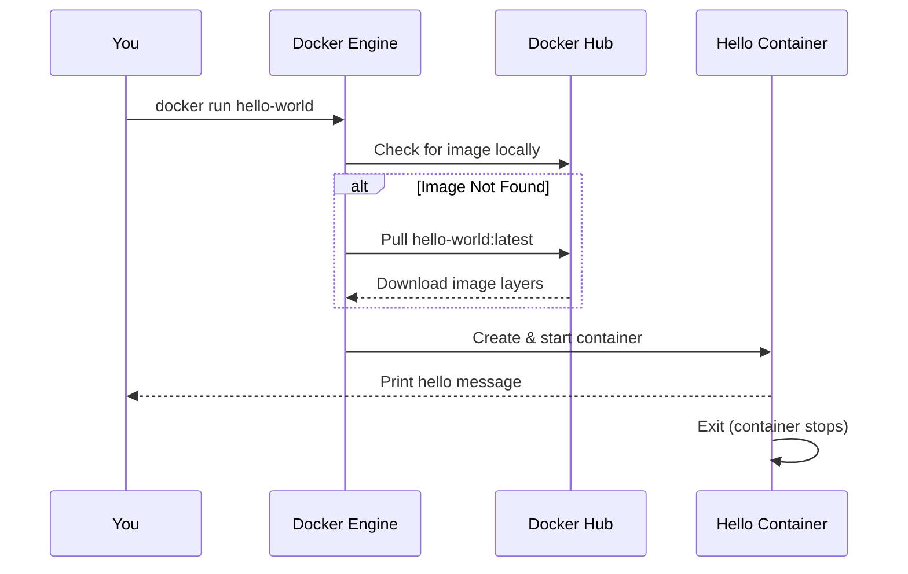

**Code:**
```bash
# Run the hello-world container
docker run hello-world

# Expected output:
# Hello from Docker!
# This message shows that your installation appears to be working correctly.

# Check if container is still running (it should be stopped)
docker ps

# See all containers including stopped ones
docker ps -a

# Clean up the stopped container
docker container prune
```

---

### **Scenario 2: Running a Web Server (Nginx)**
*Hosting a website in seconds*

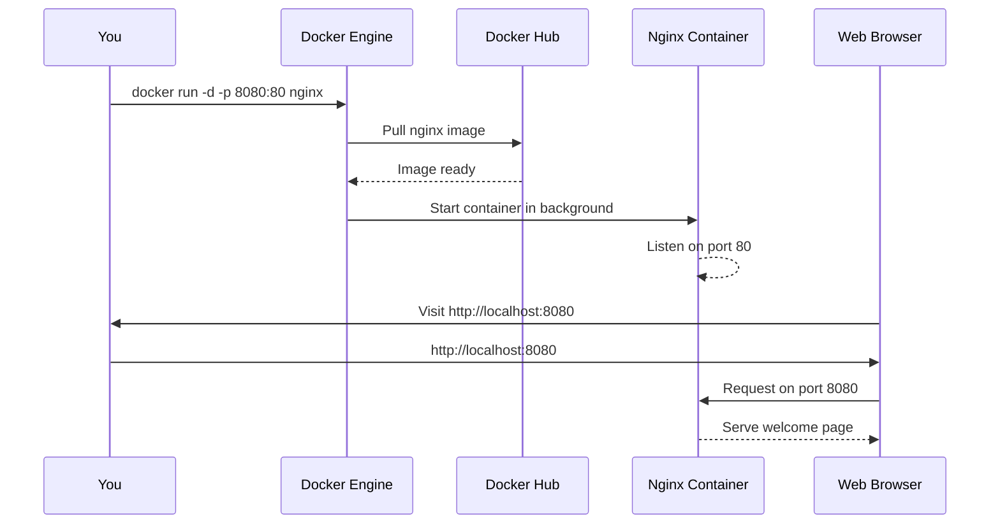

**Code:**
```bash
# Run nginx in detached mode (-d) with port mapping
docker run -d -p 8080:80 --name my-nginx nginx

# Check running containers
docker ps

# Visit http://localhost:8080 in your browser
# You'll see the "Welcome to nginx!" page

# View real-time logs
docker logs -f my-nginx

# Stop the container
docker stop my-nginx

# Remove the container
docker rm my-nginx
```

---

### **Scenario 3: Managing Containers Lifecycle**
*Everything you need to know about container operations*

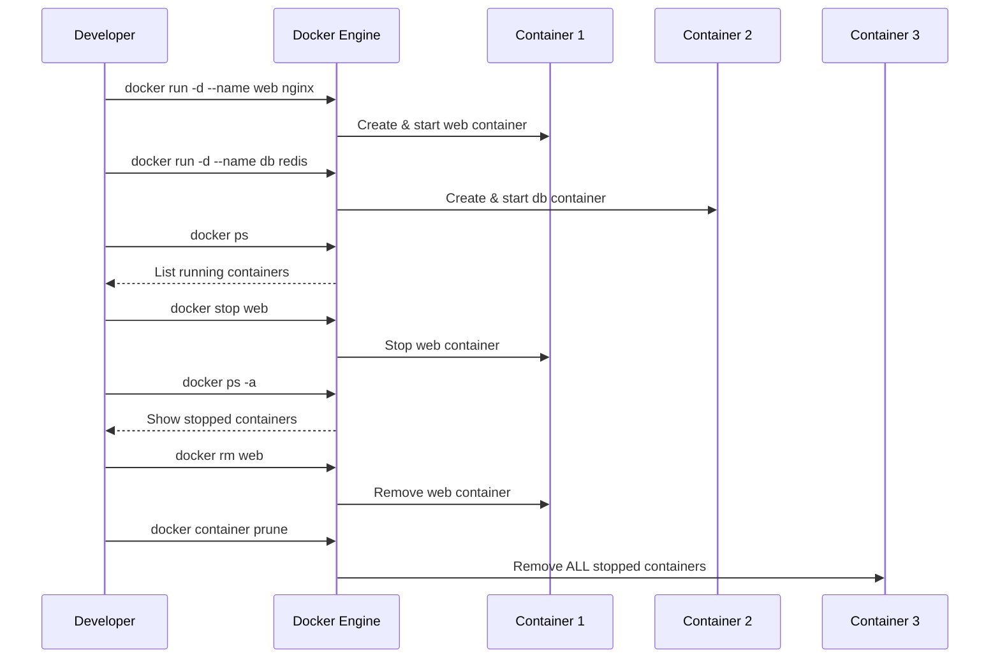

**Code:**
```bash
# Start multiple containers
docker run -d --name web-server nginx
docker run -d --name database redis

# List only running containers
docker ps
# OR
docker container ls

# List all containers (running + stopped)
docker ps -a

# Stop a specific container
docker stop web-server

# Stop multiple containers
docker stop web-server database

# Remove a stopped container
docker rm web-server

# Force remove a running container
docker rm -f database

# Remove all stopped containers
docker container prune

# Remove everything (containers, networks, volumes)
docker system prune -a
```

---

### **Scenario 4: Working with Docker Images**
*Building blocks of containers*

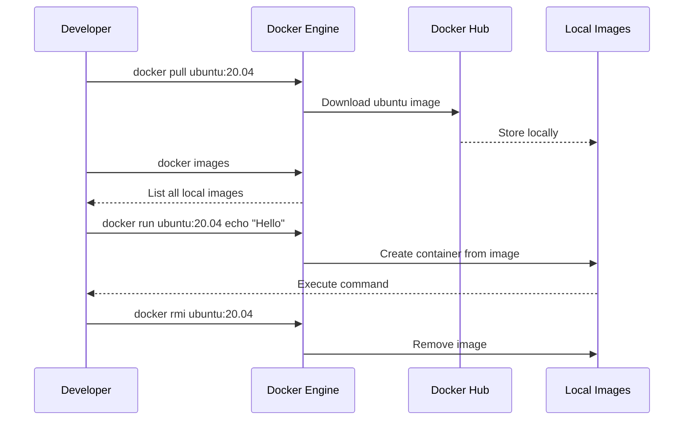

**Code:**
```bash
# Pull an image from Docker Hub
docker pull ubuntu:20.04

# List all local images
docker images
# OR
docker image ls

# Run a command in a new container
docker run ubuntu:20.04 echo "Hello from Ubuntu!"

# Check available tags for an image
docker search nginx

# Remove an image
docker rmi ubuntu:20.04

# Remove all unused images
docker image prune -a

# Tag an image for custom naming
docker tag nginx my-registry/nginx:v1.0
```

---

### **Scenario 5: Building Your First Custom Image**
*Creating a Docker image for your application*

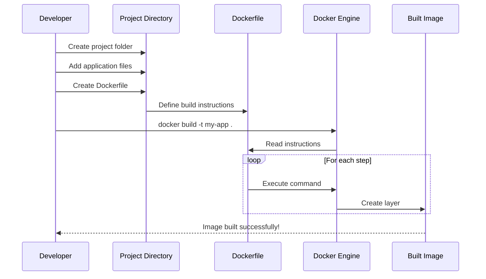

**Code:**
```bash
# Create project directory
mkdir my-docker-app && cd my-docker-app

# Create a simple Python app
cat > app.py << 'EOF'
from flask import Flask
app = Flask(__name__)

@app.route('/')
def hello():
    return "Hello from Docker!"

if __name__ == '__main__':
    app.run(host='0.0.0.0', port=5000)
EOF

# Create requirements.txt
echo "flask==2.3.2" > requirements.txt

# Create Dockerfile
cat > Dockerfile << 'EOF'
# Use Python 3.11 as base image
FROM python:3.11-slim

# Set working directory in container
WORKDIR /app

# Copy requirements file
COPY requirements.txt .

# Install Python dependencies
RUN pip install --no-cache-dir -r requirements.txt

# Copy application code
COPY app.py .

# Expose port 5000
EXPOSE 5000

# Command to run the app
CMD ["python", "app.py"]
EOF

# Build the Docker image
docker build -t my-flask-app:v1 .

# Verify image is built
docker images

# Run the container
docker run -d -p 5000:5000 --name flask-app my-flask-app:v1

# Test it: curl http://localhost:5000 or visit in browser
```

---

### **Scenario 6: Interactive Container with Bash**
*Getting inside a running container*

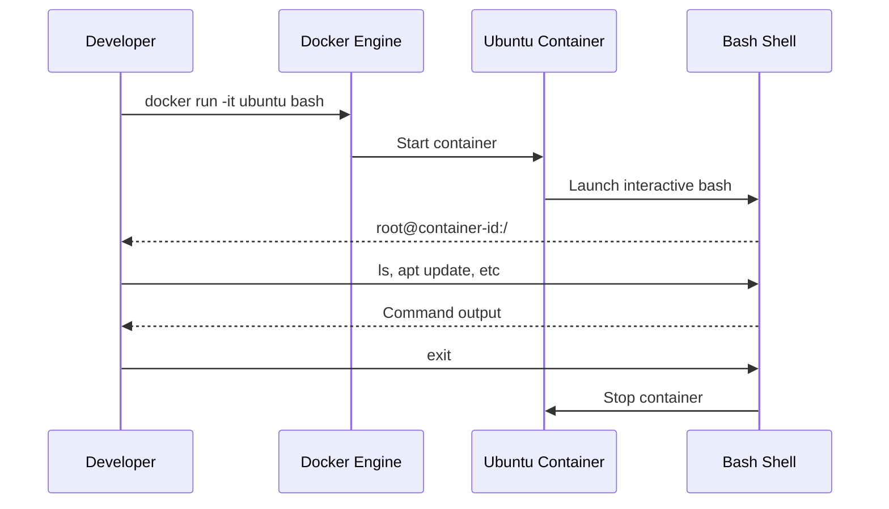

**Code:**
```bash
# Run Ubuntu container interactively with terminal
docker run -it ubuntu bash

# Inside container:
# root@123456789abc:/# ls
# root@123456789abc:/# apt update
# root@123456789abc:/# apt install -y curl
# root@123456789abc:/# exit

# Run container in background first, then exec into it
docker run -d --name my-ubuntu ubuntu sleep infinity

# Execute bash in running container
docker exec -it my-ubuntu bash

# View container processes
docker top my-ubuntu

# Copy files from host to container
echo "Hello" > test.txt
docker cp test.txt my-ubuntu:/app/

# Copy files from container to host
docker cp my-ubuntu:/etc/hosts ./hosts-backup

# Clean up
docker stop my-ubuntu && docker rm my-ubuntu
```

---

## INTERMEDIATE LEVEL: Working with Data & Networks

### **Scenario 7: Persistent Data with Volumes**
*Storing data that survives container restarts*

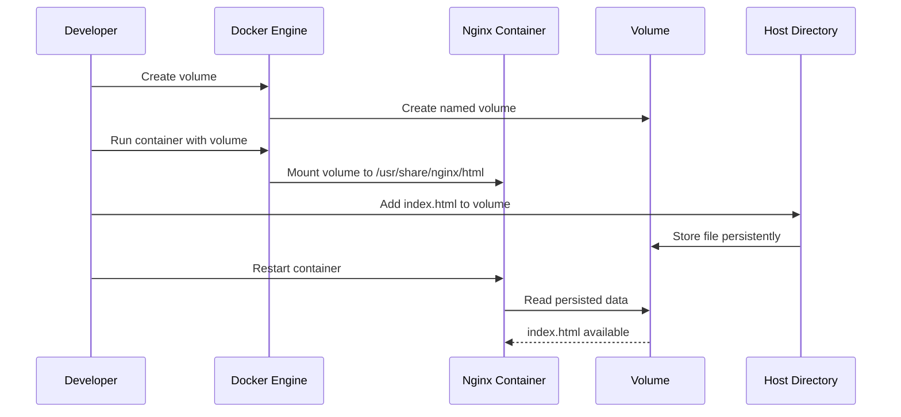

**Code:**
```bash
# Create a named volume
docker volume create my-static-files

# Inspect the volume
docker volume inspect my-static-files

# Run nginx with volume mounted
docker run -d -p 8080:80 \
  --name web-with-volume \
  -v my-static-files:/usr/share/nginx/html \
  nginx

# Create a custom HTML file in the volume
# Method 1: Use a temporary container
docker run --rm -v my-static-files:/data ubuntu bash -c "echo '<h1>Hello from Volume!</h1>' > /data/index.html"

# Method 2: Copy file directly
echo '<h1>Direct Copy</h1>' > index.html
docker cp index.html web-with-volume:/usr/share/nginx/html/

# Restart container to serve new content
docker restart web-with-volume

# View in browser: http://localhost:8080

# Use bind mount (host directory)
mkdir -p ~/docker-html
echo '<h1>Host Directory</h1>' > ~/docker-html/index.html

docker run -d -p 9090:80 \
  --name web-bind-mount \
  -v ~/docker-html:/usr/share/nginx/html \
  nginx

# Clean up
docker stop web-with-volume web-bind-mount
docker rm web-with-volume web-bind-mount
docker volume rm my-static-files
```

---

### **Scenario 8: Docker Compose for Multi-Container Apps**
*Running WordPress with MySQL using one command*

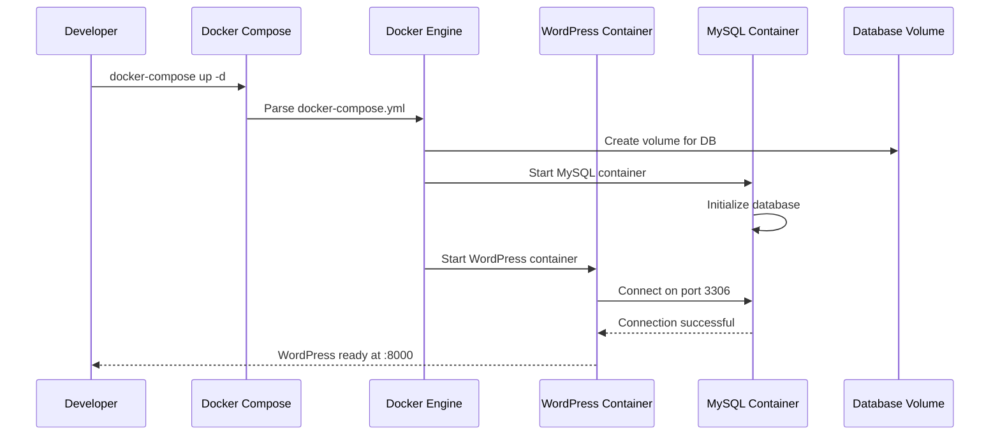

**Code:**
```bash
# Create project directory
mkdir wordpress-app && cd wordpress-app

# Create docker-compose.yml
cat > docker-compose.yml << 'EOF'
version: '3.8'

services:
  db:
    image: mysql:8.0
    container_name: wordpress-db
    environment:
      MYSQL_ROOT_PASSWORD: rootpassword123
      MYSQL_DATABASE: wordpress
      MYSQL_USER: wordpress
      MYSQL_PASSWORD: wordpresspass
    volumes:
      - db_data:/var/lib/mysql
    ports:
      - "3306:3306"
    restart: unless-stopped

  wordpress:
    image: wordpress:latest
    container_name: wordpress-app
    depends_on:
      - db
    environment:
      WORDPRESS_DB_HOST: db:3306
      WORDPRESS_DB_USER: wordpress
      WORDPRESS_DB_PASSWORD: wordpresspass
      WORDPRESS_DB_NAME: wordpress
    ports:
      - "8000:80"
    restart: unless-stopped

volumes:
  db_data:
EOF

# Start all services in background
docker-compose up -d

# View logs
docker-compose logs -f

# List running containers
docker-compose ps

# Stop all services
docker-compose down

# Stop and remove volumes (WARNING: data loss!)
docker-compose down -v

# Scale WordPress instances (requires load balancer)
docker-compose up -d --scale wordpress=3
```

---

### **Scenario 9: Container Networking**
*Connecting containers without exposing ports*

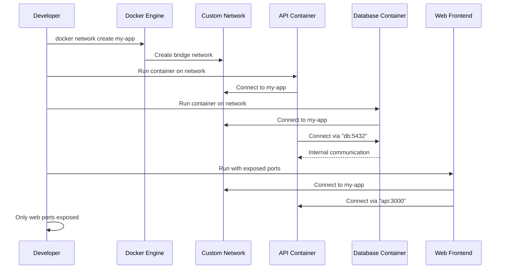

**Code:**
```bash
# Create a custom bridge network
docker network create my-app-network

# Inspect the network
docker network inspect my-app-network

# Run PostgreSQL on the network (not exposed to host)
docker run -d \
  --name database \
  --network my-app-network \
  -e POSTGRES_PASSWORD=secret \
  postgres:15

# Run API that connects to database
docker run -d \
  --name api-server \
  --network my-app-network \
  -e DB_HOST=database \
  -e DB_PASSWORD=secret \
  node-api-app

# Run web frontend with port exposed
docker run -d \
  --name web-frontend \
  --network my-app-network \
  -p 3000:3000 \
  react-app

# Test connectivity from within network
docker exec -it api-server bash
# Inside api-server container:
# ping database
# curl http://api-server:3000

# List networks
docker network ls

# Disconnect container from network
docker network disconnect my-app-network api-server

# Connect container to network
docker network connect my-app-network api-server

# Clean up
docker stop web-frontend api-server database
docker rm web-frontend api-server database
docker network rm my-app-network
```

---

### **Scenario 10: Environment Variables & Configuration**
*Configuring containers without hardcoding*

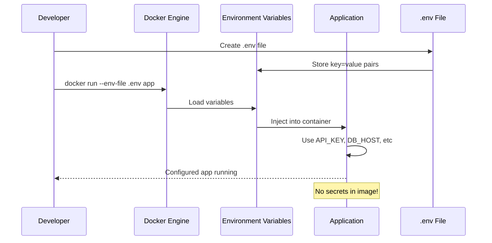

**Code:**
```bash
# Create .env file
cat > .env << 'EOF'
APP_ENV=production
API_KEY=sk-1234567890abcdef
DB_HOST=postgres.example.com
DB_PORT=5432
DEBUG=false
EOF

# Run container with env file
docker run -d \
  --name config-app \
  --env-file .env \
  -p 5000:5000 \
  my-python-app

# Override specific environment variable
docker run -d \
  --name dev-app \
  --env-file .env \
  -e APP_ENV=development \
  -e DEBUG=true \
  -p 5001:5000 \
  my-python-app

# View container environment variables
docker exec config-app env

# Pass secrets securely (not in command history)
echo "supersecretpassword" | docker run -i \
  --name secure-app \
  -e DB_PASSWORD=stdin \
  my-app

# Use Docker secrets (swarm mode)
echo "my_secret" | docker secret create db_password -
docker service create \
  --secret db_password \
  --name app \
  my-app
```

---

### **Scenario 11: Debugging & Monitoring**
*Inspecting running containers*

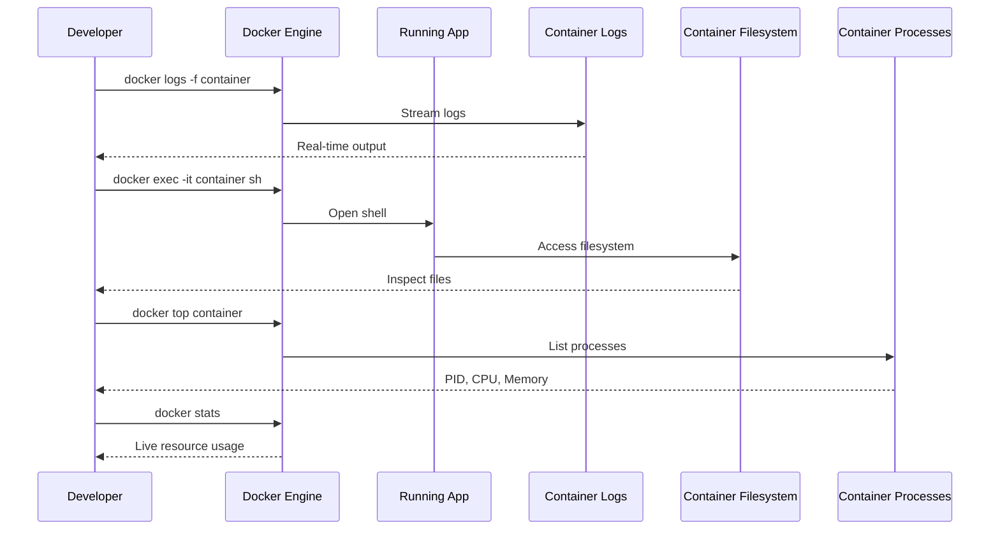

**Code:**
```bash
# Run a problematic container
docker run -d --name buggy-app node-app

# View all logs
docker logs buggy-app

# Follow logs in real-time (like tail -f)
docker logs -f buggy-app

# Show last 50 lines of logs
docker logs --tail 50 buggy-app

# Show logs with timestamps
docker logs -t buggy-app

# Get inside running container
docker exec -it buggy-app sh
# Or if bash is available:
docker exec -it buggy-app bash

# Inside container:
# ps aux
# cat /app/logs/error.log
# exit

# View running processes
docker top buggy-app

# View resource usage (live)
docker stats buggy-app

# Inspect container details (IP, mounts, config)
docker inspect buggy-app

# Copy a file from container for analysis
docker cp buggy-app:/app/debug.log ./debug.log

# Health check in Dockerfile
cat > Dockerfile << 'EOF'
FROM nginx
HEALTHCHECK --interval=30s --timeout=3s \
  CMD curl -f http://localhost/ || exit 1
EOF
```

---

## ADVANCED LEVEL: Production-Ready Docker

### **Scenario 12: Multi-Stage Builds**
*Optimizing image size for production*

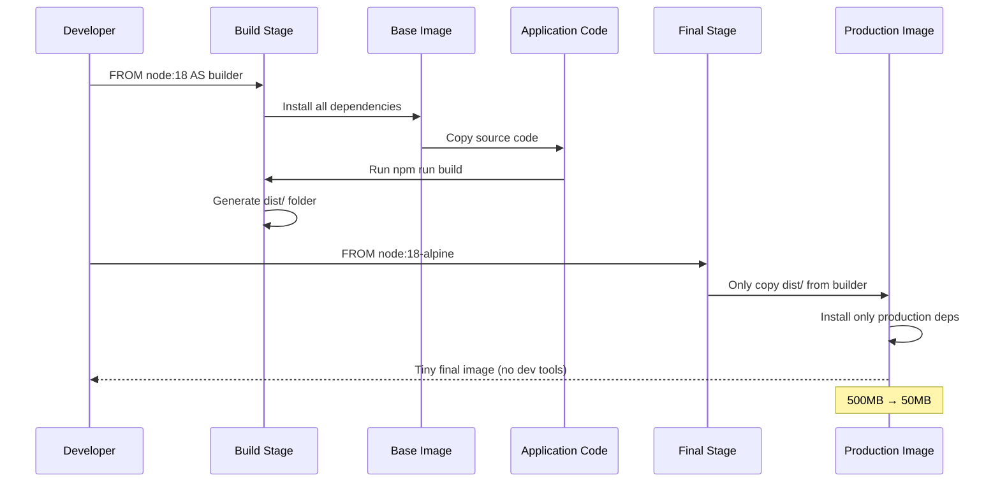

**Code:**
```bash
# Create optimized Node.js Dockerfile
cat > Dockerfile << 'EOF'
# STAGE 1: Build environment
FROM node:18 AS builder

WORKDIR /app

# Copy dependency files
COPY package*.json ./

# Install ALL dependencies (including dev)
RUN npm ci

# Copy source code
COPY . .

# Build the application
RUN npm run build

# Remove dev dependencies
RUN npm prune --production

# STAGE 2: Production environment
FROM node:18-alpine

# Create non-root user
RUN addgroup -g 1001 -S nodejs
RUN adduser -S nodeuser -u 1001

WORKDIR /app

# Copy only necessary files from builder stage
COPY --from=builder --chown=nodeuser:nodejs /app/dist ./dist
COPY --from=builder --chown=nodeuser:nodejs /app/node_modules ./node_modules
COPY --from=builder --chown=nodeuser:nodejs /app/package.json ./

# Switch to non-root user
USER nodeuser

# Expose port
EXPOSE 3000

# Start application
CMD ["node", "dist/index.js"]
EOF

# Build the multi-stage image
docker build -t my-app:multi-stage .

# Compare image sizes
docker images my-app:multi-stage

# Build without multi-stage for comparison
# (Create simple Dockerfile and build)
docker build -t my-app:simple -f Dockerfile.simple .

# Push to registry
docker tag my-app:multi-stage myregistry.com/my-app:latest
docker push myregistry.com/my-app:latest
```

---

### **Scenario 13: Docker Registry & Image Management**
*Storing and sharing images*

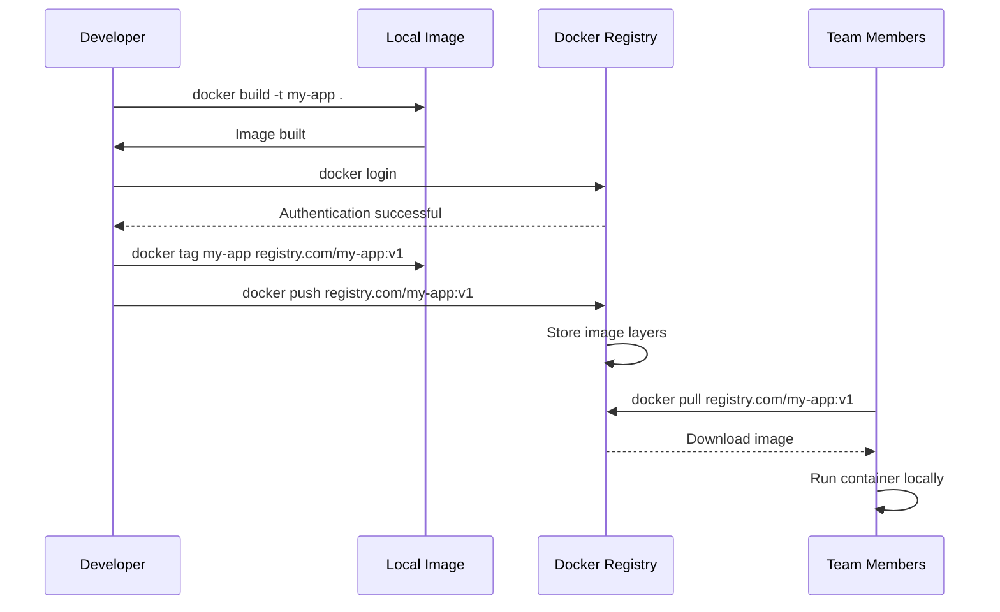

**Code:**
```bash
# Tag your image for registry
docker tag my-flask-app:v1 your-registry.com/my-flask-app:v1

# Login to registry (Docker Hub)
docker login

# Or login to private registry
docker login your-registry.com

# Push image
docker push your-registry.com/my-flask-app:v1

# Pull image on another machine
docker pull your-registry.com/my-flask-app:v1

# List all images
docker images

# Remove dangling (untagged) images
docker image prune

# Save image to tar file (offline transfer)
docker save -o my-app.tar your-registry.com/my-flask-app:v1

# Load image from tar file
docker load -i my-app.tar

# Scan image for vulnerabilities
docker scan your-registry.com/my-flask-app:v1

# Tag with semantic versioning
docker tag my-app:v1 your-registry.com/my-app:1.0.0
docker tag my-app:v1 your-registry.com/my-app:latest

# Push all tags
docker push your-registry.com/my-app --all-tags
```

---

### **Scenario 14: Resource Limits & Health Checks**
*Production-ready container configuration*

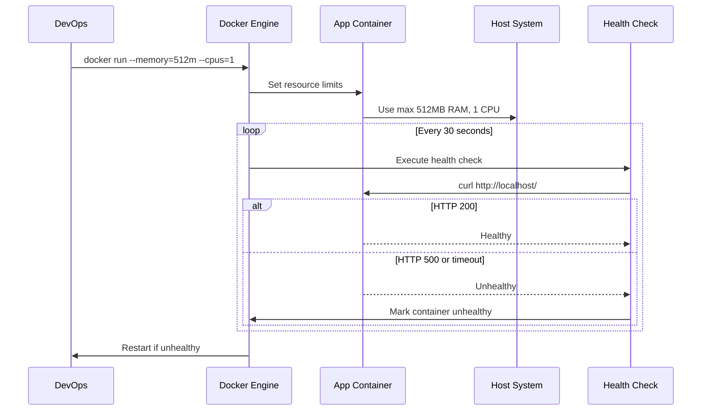

**Code:**
```bash
# Run container with resource limits
docker run -d \
  --name production-app \
  --memory=512m \
  --memory-swap=1g \
  --cpus=1.0 \
  --cpu-shares=1024 \
  -p 3000:3000 \
  my-node-app

# Set hard memory limit (kill if exceeded)
docker run -d \
  --name strict-app \
  --memory=256m \
  --memory-swap=256m \
  my-app

# Add health check to Dockerfile
cat > Dockerfile << 'EOF'
FROM node:18-alpine

WORKDIR /app
COPY package*.json ./
RUN npm ci --only=production
COPY . .

EXPOSE 3000

# Health check every 30s, timeout 10s, start after 5s
HEALTHCHECK --interval=30s --timeout=10s --start-period=5s --retries=3 \
  CMD curl -f http://localhost:3000/health || exit 1

CMD ["node", "server.js"]
EOF

# Run with restart policy
docker run -d \
  --name auto-restart-app \
  --restart unless-stopped \
  -p 3000:3000 \
  my-node-app

# Restart policies:
# no: never restart (default)
# on-failure: restart on non-zero exit
# always: always restart
# unless-stopped: restart unless manually stopped

# View health status
docker ps
# HEALTH STATUS column shows: healthy/unhealthy/starting

# Check detailed health info
docker inspect --format='{{json .State.Health}}' auto-restart-app
```

---

### **Scenario 15: Security Best Practices**
*Running containers securely*

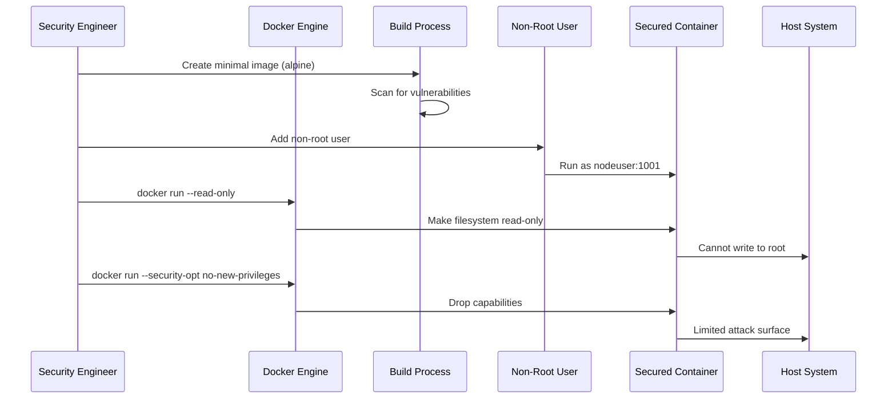

**Code:**
```bash
# Dockerfile with security best practices
cat > Dockerfile.secure << 'EOF'
# Use minimal base image
FROM node:18-alpine

# Install security updates
RUN apk update && apk upgrade

# Create non-root user
RUN addgroup -g 1001 -S nodejs && \
    adduser -S nodeuser -u 1001 -G nodejs

# Set working directory with correct permissions
WORKDIR /app
RUN chown nodeuser:nodejs /app

# Switch to non-root user BEFORE copying files
USER nodeuser

# Copy dependency files and install
COPY --chown=nodeuser:nodejs package*.json ./
RUN npm ci --only=production

# Copy application code
COPY --chown=nodeuser:nodejs . .

# Make port available
EXPOSE 3000

# Health check
HEALTHCHECK --interval=30s CMD curl -f http://localhost:3000/health || exit 1

# Run the app
CMD ["node", "server.js"]
EOF

# Run with security options
docker run -d \
  --name secure-app \
  --user 1001:1001 \
  --read-only \
  --tmpfs /tmp \
  --cap-drop ALL \
  --cap-add CHOWN \
  --cap-add SETGID \
  --cap-add SETUID \
  --security-opt no-new-privileges \
  --security-opt apparmor=docker-default \
  -p 3000:3000 \
  my-secure-app

# Scan image for vulnerabilities
docker scan my-secure-app

# Use docker-bench-security for compliance
docker run -it --net host --pid host --cap-add audit_control \
  -e DOCKER_CONTENT_TRUST=$DOCKER_CONTENT_TRUST \
  -v /var/lib:/var/lib \
  -v /var/run/docker.sock:/var/run/docker.sock \
  -v /usr/lib/systemd:/usr/lib/systemd \
  -v /etc:/etc --label docker_bench_security \
  docker/docker-bench-security
```

---

### **Scenario 16: Advanced Docker Compose**
*Production-ready multi-service setup*

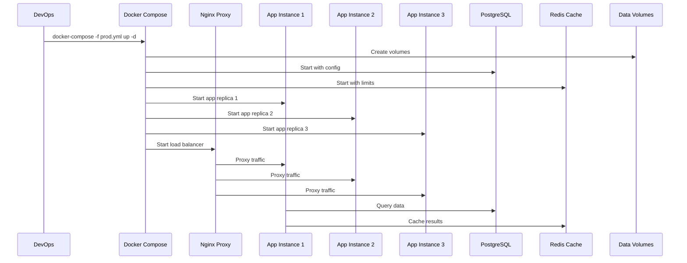

**Code:**
```bash
# docker-compose.prod.yml
cat > docker-compose.prod.yml << 'EOF'
version: '3.8'

services:
  # Load Balancer
  nginx:
    image: nginx:alpine
    container_name: prod-proxy
    ports:
      - "80:80"
      - "443:443"
    volumes:
      - ./nginx.conf:/etc/nginx/nginx.conf:ro
      - ssl_certs:/etc/ssl/certs
    depends_on:
      - app
    restart: unless-stopped
    healthcheck:
      test: ["CMD", "curl", "-f", "http://localhost/health"]
      interval: 30s
    deploy:
      resources:
        limits:
          cpus: '0.5'
          memory: 128M

  # Application (3 replicas)
  app:
    image: my-app:latest
    deploy:
      replicas: 3
      resources:
        limits:
          cpus: '1'
          memory: 512M
        reservations:
          cpus: '0.5'
          memory: 256M
      restart_policy:
        condition: on-failure
        delay: 5s
    environment:
      - NODE_ENV=production
      - DB_HOST=db
      - REDIS_HOST=cache
    depends_on:
      - db
      - cache
    healthcheck:
      test: ["CMD", "curl", "-f", "http://localhost:3000/health"]
      interval: 30s
      timeout: 10s
      retries: 3
    networks:
      - backend

  # Database
  db:
    image: postgres:15-alpine
    container_name: prod-db
    environment:
      POSTGRES_DB: myapp_prod
      POSTGRES_USER: app_user
      POSTGRES_PASSWORD_FILE: /run/secrets/db_password
    secrets:
      - db_password
    volumes:
      - db_data:/var/lib/postgresql/data
      - ./init.sql:/docker-entrypoint-initdb.d/init.sql:ro
    ports:
      - "5432:5432"
    restart: unless-stopped
    deploy:
      resources:
        limits:
          memory: 1G
    networks:
      - backend

  # Redis Cache
  cache:
    image: redis:7-alpine
    container_name: prod-cache
    command: redis-server --requirepass ${REDIS_PASSWORD}
    environment:
      REDIS_PASSWORD_FILE: /run/secrets/redis_password
    secrets:
      - redis_password
    volumes:
      - cache_data:/data
    restart: unless-stopped
    deploy:
      resources:
        limits:
          memory: 256M
    networks:
      - backend

volumes:
  db_data:
    driver: local
  cache_data:
    driver: local
  ssl_certs:
    driver: local

secrets:
  db_password:
    external: true
  redis_password:
    external: true

networks:
  backend:
    driver: bridge
EOF

# Create secrets (requires Docker Swarm or Docker Compose 1.25+)
echo "supersecurepassword" | docker secret create db_password -
echo "anothersecret" | docker secret create redis_password -

# Deploy with production config
docker-compose -f docker-compose.prod.yml up -d

# Scale specific service
docker-compose -f docker-compose.prod.yml up -d --scale app=5

# Rolling update
docker-compose -f docker-compose.prod.yml pull app
docker-compose -f docker-compose.prod.yml up -d --no-deps app

# View logs for all services
docker-compose -f docker-compose.prod.yml logs -f

# Check service status
docker-compose -f docker-compose.prod.yml ps

# Clean up everything
docker-compose -f docker-compose.prod.yml down -v --remove-orphans
```

---

## Quick Reference: Essential Commands

| Command | Description | Level |
| :--- | :--- | :--- |
| `docker run <image>` | Run a container from an image | Beginner |
| `docker ps` | List running containers | Beginner |
| `docker images` | List available images | Beginner |
| `docker pull <image>` | Download an image | Beginner |
| `docker build -t <tag> .` | Build image from Dockerfile | Beginner |
| `docker exec -it <container> bash` | Run command in container | Beginner |
| `docker stop <container>` | Stop a running container | Beginner |
| `docker rm <container>` | Remove a container | Beginner |
| `docker rmi <image>` | Remove an image | Beginner |
| `docker volume create <name>` | Create a persistent volume | Intermediate |
| `docker network create <name>` | Create a network | Intermediate |
| `docker-compose up -d` | Start multi-container app | Intermediate |
| `docker logs -f <container>` | Follow container logs | Intermediate |
| `docker inspect <container>` | View detailed container info | Intermediate |
| `docker system prune -a` | Clean up all unused resources | Intermediate |
| `docker build --target <stage>` | Build specific stage | Advanced |
| `docker scan <image>` | Scan for vulnerabilities | Advanced |
| `docker secret create <name>` | Create a secret (Swarm) | Advanced |
| `docker service create` | Create a service (Swarm) | Advanced |
| `docker stack deploy` | Deploy stack (Swarm) | Advanced |

---

## Pro Tips for All Levels

1. **Use specific image tags**: `nginx:1.24-alpine` > `nginx:latest`
2. **Keep images small**: Use Alpine Linux variants when possible
3. **Never store secrets in images**: Use environment variables or Docker secrets
4. **Always use volumes for persistent data**: Containers are ephemeral
5. **Scan images for vulnerabilities**: `docker scan <image>`
6. **Use `.dockerignore`**: Exclude files from build context (like `.gitignore`)
7. **One process per container**: Follow microservices architecture
8. **Use health checks**: Ensure containers are actually working
9. **Clean up regularly**: `docker system prune` to free disk space
10. **Learn Docker Compose**: It's essential for multi-container apps

Happy containerizing! 🐳