# Git Complete Master Guide

Git is a distributed version control system that tracks changes in your code, enables collaboration, and maintains project history.

---

## Installation Guide

### **Windows**
Download and install from [git-scm.com](https://git-scm.com/download/win) or use winget:
```bash
winget install --id Git.Git -e --source winget
```

### **macOS**
Install using Homebrew:
```bash
brew install git
```

### **Linux (Ubuntu/Debian)**
```bash
sudo apt update
sudo apt install git -y
```

Verify installation:
```bash
git --version
```

---

## BEGINNER LEVEL: First Steps with Git

### **Scenario 1: Initial Setup & Configuration**
*Setting up your identity before using Git*

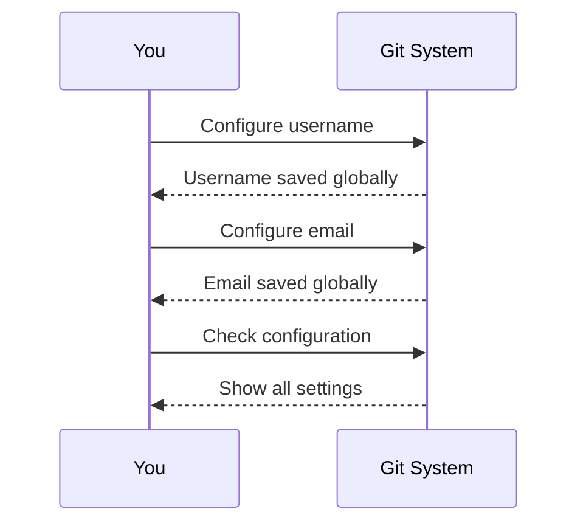

**Code:**
```bash
# Set your name (will appear in commits)
git config --global user.name "Your Full Name"

# Set your email (must match GitHub/GitLab)
git config --global user.email "your.email@example.com"

# Verify your configuration
git config --list

# Set default branch name to "main"
git config --global init.defaultBranch main
```

---

### **Scenario 2: Starting a Brand New Repository**
*Creating your first Git repository from scratch*

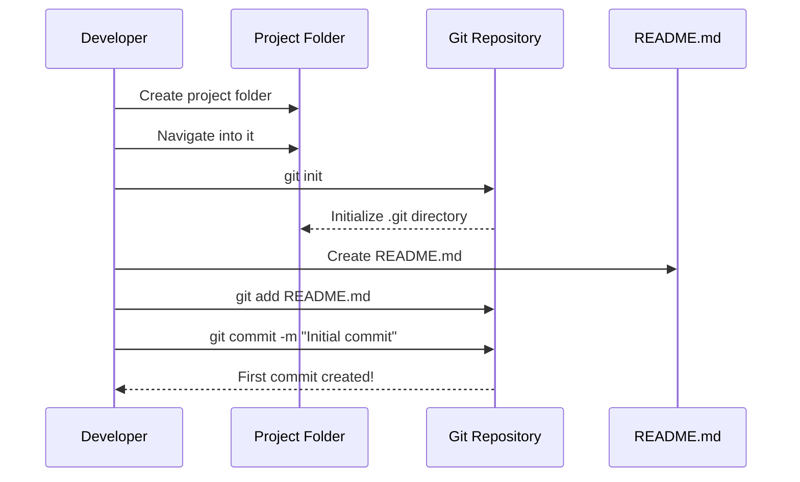

**Code:**
```bash
# Create a new project folder
mkdir my-awesome-project
cd my-awesome-project

# Initialize git repository
git init

# Create your first file
echo "# My Project" > README.md

# Check status (shows untracked files)
git status

# Stage the file for commit
git add README.md
# Or stage all files: git add .

# Commit with a descriptive message
git commit -m "Initial commit: Add README with project description"

# View commit history
git log
```

---

### **Scenario 3: Cloning an Existing Repository**
*Getting a remote project onto your computer*

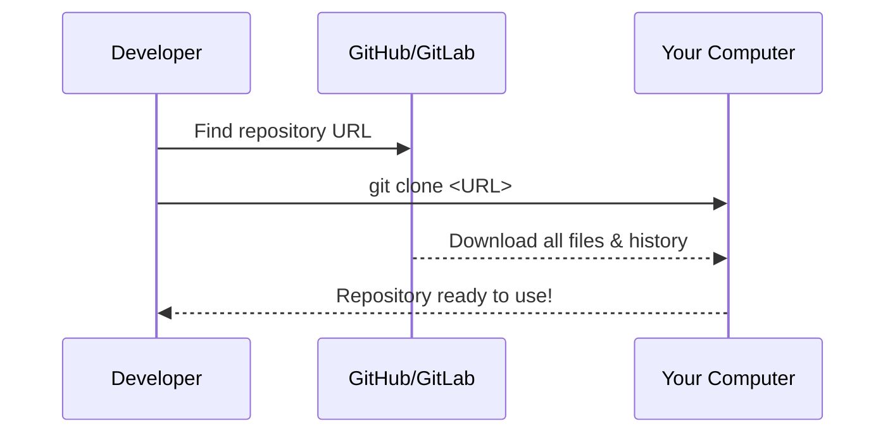

**Code:**
```bash
# Clone a public repository
git clone https://github.com/user/repository.git

# Clone into a specific folder name
git clone https://github.com/user/repository.git my-folder-name

# Clone only the latest commit (faster)
git clone --depth 1 https://github.com/user/repository.git

# View remote connections
git remote -v
```

---

### **Scenario 4: Making Changes and Committing**
*The daily workflow of saving your work*

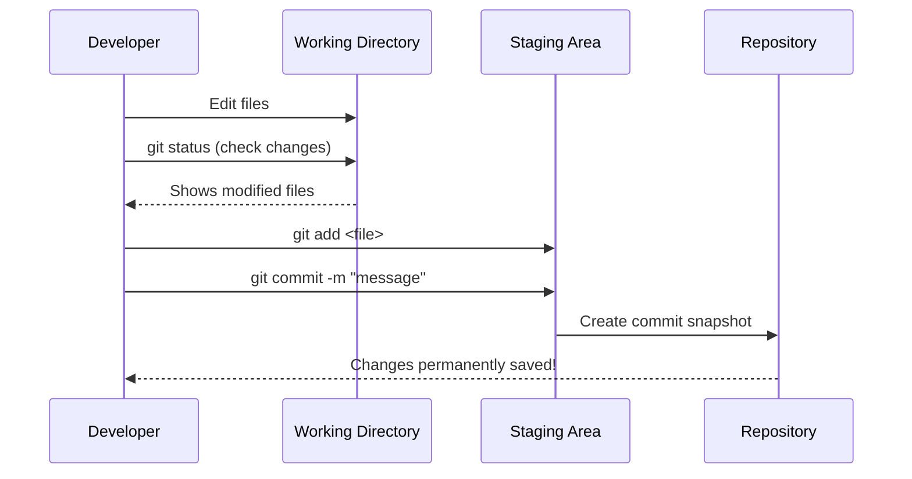

**Code:**
```bash
# Edit your files (use any text editor)
# For example, edit README.md

# Check what changed (CRITICAL STEP)
git status

# Stage specific file
git add README.md

# Stage all changes in current directory
git add .

# Commit with meaningful message
git commit -m "Update README with installation instructions"

# Check status again (should be clean)
git status

# View your commit
git log --oneline
```

---

### **Scenario 5: Pushing to Remote Repository**
*Uploading your local commits to GitHub/GitLab*

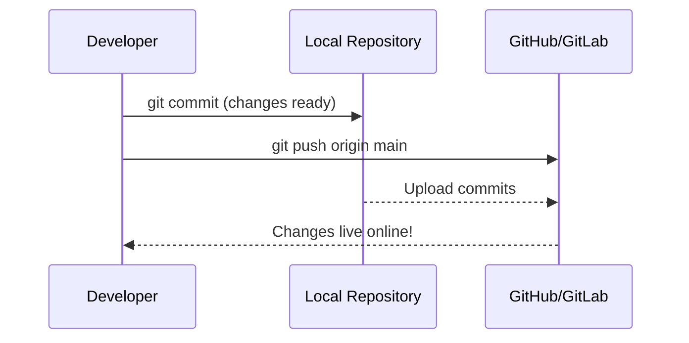

**Code:**
```bash
# First, link to remote repository (if not cloned)
git remote add origin https://github.com/your-username/repo.git

# Verify remote
git remote -v

# Push to main branch
git push origin main
# Older repositories might use 'master' instead of 'main'

# Push current branch (Git 2.0+)
git push -u origin main

# For subsequent pushes (after -u)
git push

# Force push (USE WITH CAUTION!)
git push --force-with-lease origin main
```

---

### **Scenario 6: Pulling Latest Changes**
*Getting updates from your team*

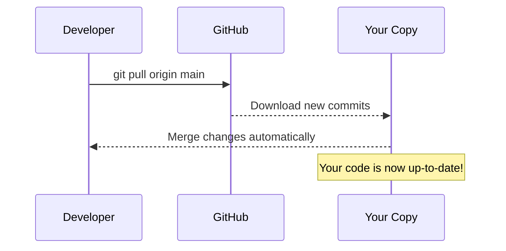

**Code:**
```bash
# Pull latest changes and merge
git pull origin main

# Fetch changes without merging (review first)
git fetch origin

# See what changed
git log origin/main --oneline

# Merge fetched changes
git merge origin/main

# Pull with rebase (cleaner history)
git pull --rebase origin main

# Check for conflicts after pull
git status
```

---

## INTERMEDIATE LEVEL: Branching & Collaboration

### **Scenario 7: Creating and Switching Branches**
*Isolating features from main code*

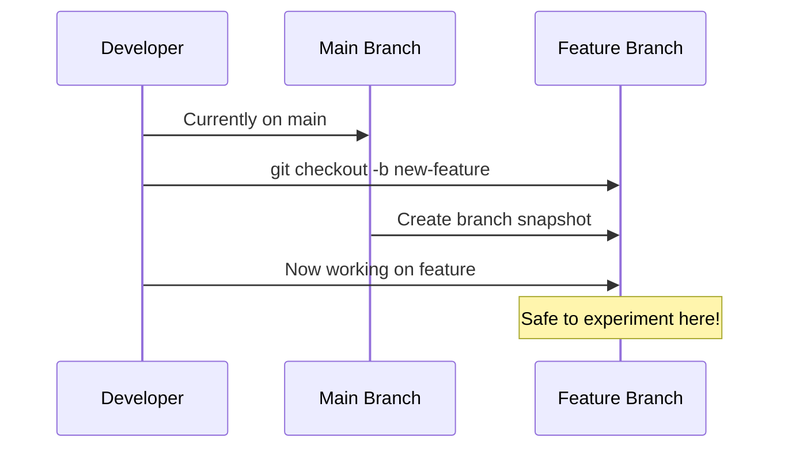

**Code:**
```bash
# Create and switch to new branch
git checkout -b feature-login-system

# Equivalent to:
git branch feature-login-system
git checkout feature-login-system

# Switch to existing branch
git checkout main

# List all local branches
git branch

# List all branches (including remote)
git branch -a

# Rename current branch
git branch -m better-branch-name
```

---

### **Scenario 8: Merging Branches**
*Combining your feature back into main*

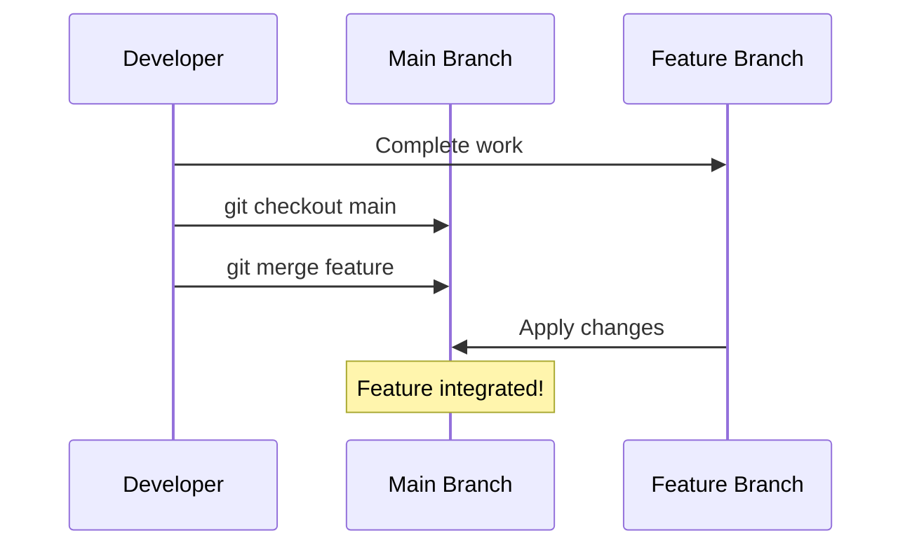

**Code:**
```bash
# Complete your feature work and commit
git add .
git commit -m "Add complete login functionality"

# Switch to main branch
git checkout main

# Ensure main is up-to-date
git pull origin main

# Merge your feature branch
git merge feature-login-system

# If no conflicts: automatic merge!
# If conflicts: manual resolution needed

# After successful merge, delete feature branch
git branch -d feature-login-system

# Push merged changes
git push origin main
```

---

### **Scenario 9: Handling Merge Conflicts**
*When Git can't automatically merge*

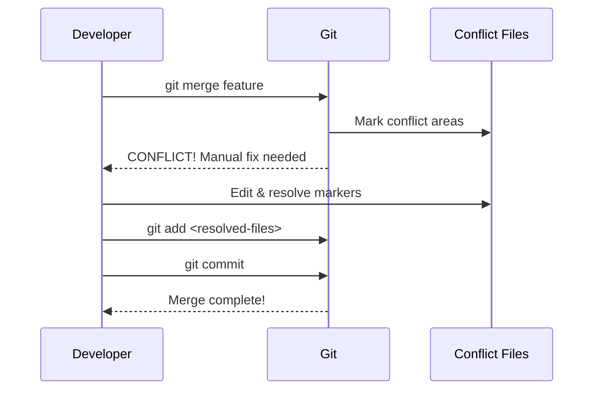

**Code:**
```bash
# Attempt merge that causes conflict
git merge another-feature

# Check which files have conflicts
git status

# Open conflicted file(s), see markers:
# <<<<<<< HEAD
# Your changes
# =======
# Their changes
# >>>>>>> branch-name

# Edit file manually, keep desired code
# Remove all <<<<<, =====, >>>>> markers

# After fixing all conflicts:
git add README.md
git add other-conflicted-file.js

# Complete the merge
git commit
# Editor opens - save default merge message

# If merge is too messy, abort:
git merge --abort

# Verify merge
git log --oneline --graph
```

---

### **Scenario 10: Stashing Changes**
*Temporarily saving incomplete work*

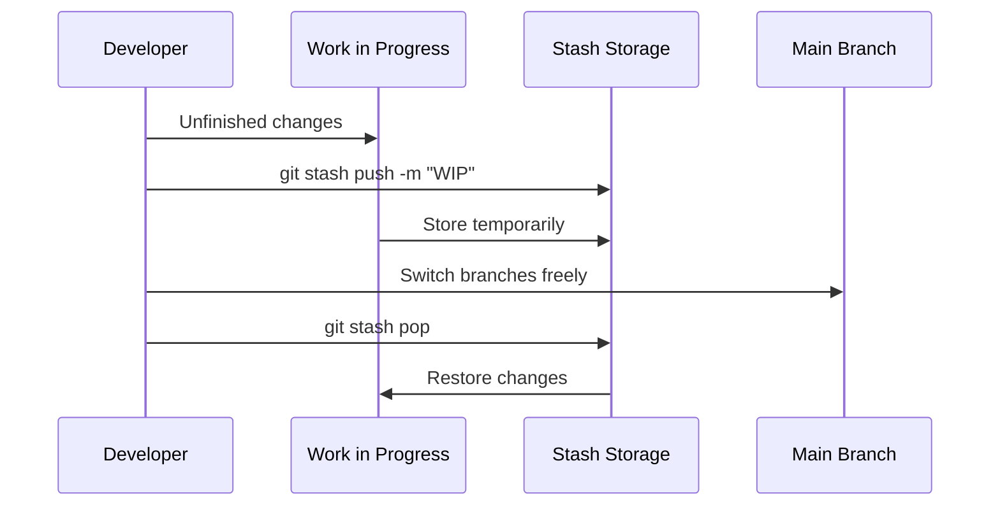

**Code:**
```bash
# Save uncommitted changes
git stash push -m "Work in progress on login form"

# View stashed items
git stash list

# Apply most recent stash (keeps it in stash)
git stash apply

# Apply and remove from stash
git stash pop

# Apply specific stash
git stash apply stash@{1}

# Drop a stash
git stash drop stash@{0}

# Clear all stashes
git stash clear
```

---

### **Scenario 11: Undoing a Commit**
*Fixing mistakes in your recent history*

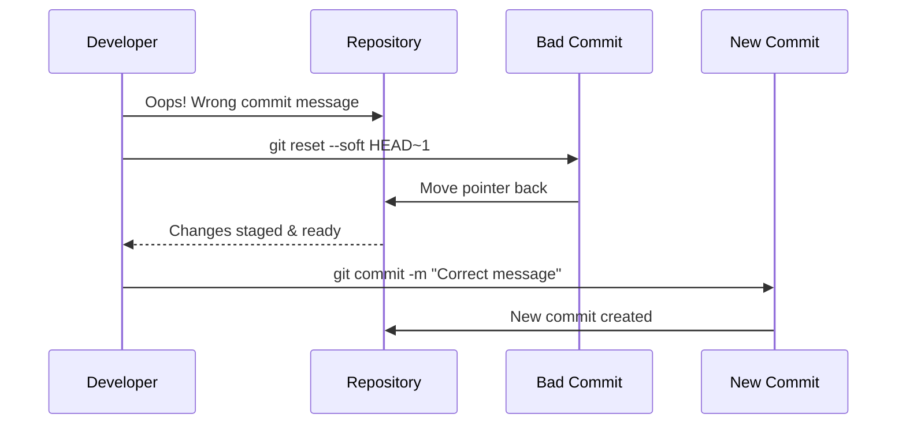

**Code:**
```bash
# FIX LAST COMMIT MESSAGE (keeps changes)
git commit --amend -m "Correct commit message"

# CANCEL LAST COMMIT but keep changes staged
git reset --soft HEAD~1

# CANCEL LAST COMMIT and unstage changes
git reset --mixed HEAD~1

# DANGER: Completely delete last commit
git reset --hard HEAD~1

# Create a "revert commit" (safe for shared branches)
git revert HEAD
# This creates a NEW commit that undoes changes
```

---

## ADVANCED LEVEL: Master Git Workflows

### **Scenario 12: Interactive Rebase**
*Rewriting history for clean commits*

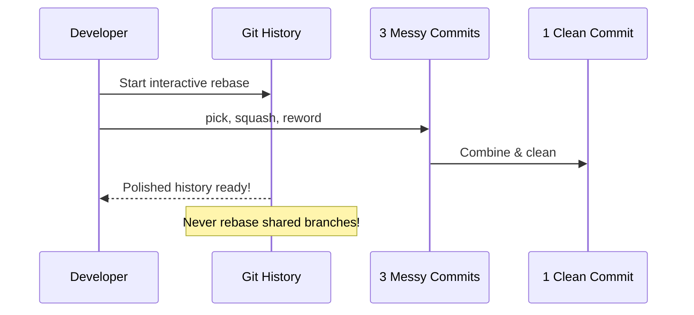

**Code:**
```bash
# Start interactive rebase for last 3 commits
git rebase -i HEAD~3

# Editor opens - change commands:
# pick a1b2c3d First commit
# squash d4e5f6a Second commit
# squash g7h8i9b Third commit

# Save and close - editor reopens for final message

# Reword a commit message
git rebase -i HEAD~2
# Change 'pick' to 'reword' on target commit

# Abort rebase if something goes wrong
git rebase --abort

# Continue after resolving conflicts
git rebase --continue
```

---

### **Scenario 13: Cherry-Picking**
*Applying specific commits to another branch*

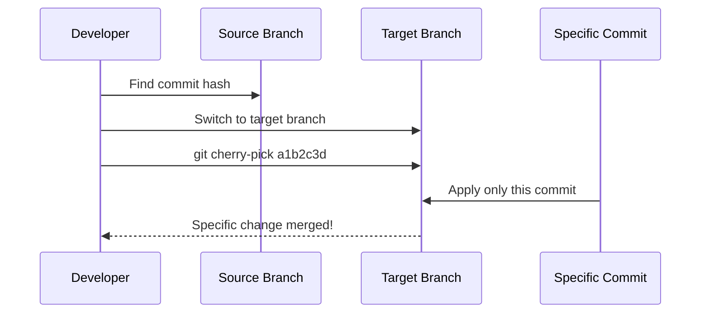

**Code:**
```bash
# Find commit hash to cherry-pick
git log --oneline

# Switch to target branch
git checkout target-branch

# Apply specific commit
git cherry-pick a1b2c3d4

# Cherry-pick multiple commits
git cherry-pick a1b2c3d..f5e6d7c

# Abort if conflicts occur
git cherry-pick --abort

# Continue after fixing conflicts
git cherry-pick --continue
```

---

### **Scenario 14: Git Bisect Debugging**
*Find the commit that introduced a bug*

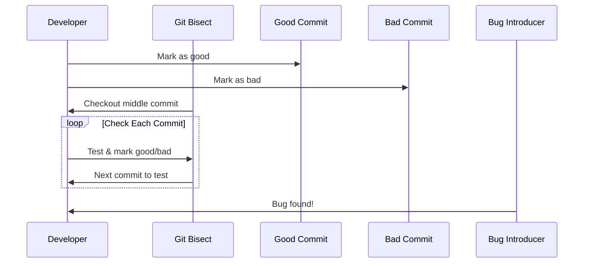

**Code:**
```bash
# Start bisect session
git bisect start

# Mark current commit as bad
git bisect bad

# Mark earlier commit as good
git bisect good a1b2c3d

# Git checks out middle commit
# Test your code...

# If bug exists:
git bisect bad

# If bug is gone:
git bisect good

# Repeat until Git identifies culprit
# Output: "first bad commit is: [hash]"

# End bisect session
git bisect reset
```

---

### **Scenario 15: Working with Submodules**
*Managing repositories inside repositories*

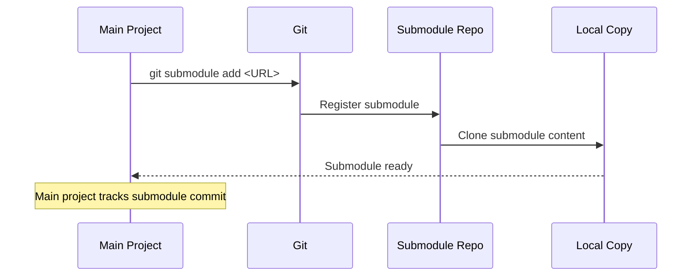

**Code:**
```bash
# Add a submodule to your project
git submodule add https://github.com/user/library.git libs/super-lib

# Initialize submodules after clone
git submodule init

# Update submodule content
git submodule update

# Clone with submodules recursively
git clone --recurse-submodules https://github.com/user/main-project.git

# Pull updates for submodules
git submodule update --remote

# Commit submodule changes (points to new commit)
cd libs/super-lib
git checkout v2.0
cd ../..
git add libs/super-lib
git commit -m "Update super-lib to v2.0"
```

---

### **Scenario 16: Git Hooks Automation**
*Running scripts automatically*

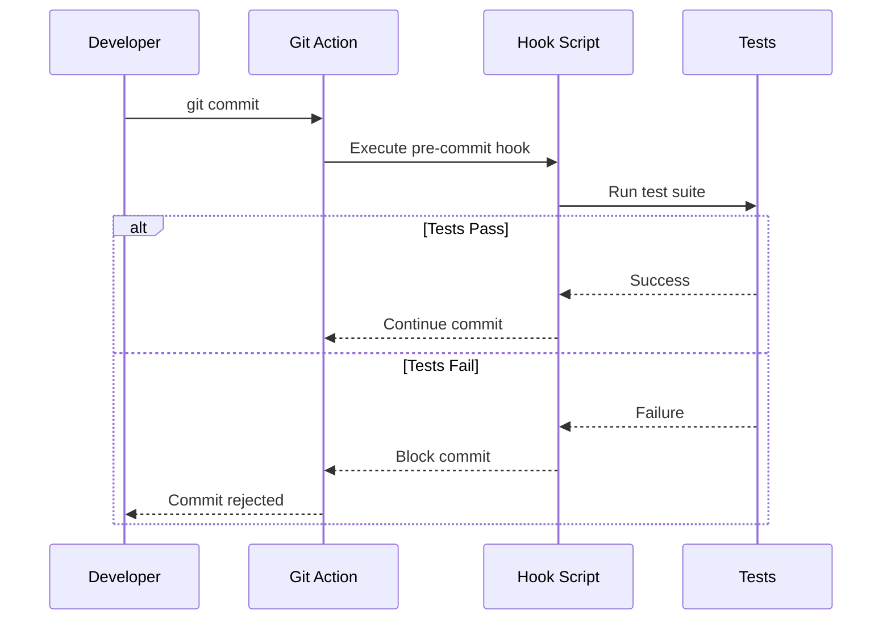

**Code:**
```bash
# Go to your repository's hooks directory
cd .git/hooks

# Create a pre-commit hook
cat > pre-commit << 'EOF'
#!/bin/bash
# Run tests before allowing commit
echo "Running pre-commit tests..."
npm test

# If tests fail, block commit
if [ $? -ne 0 ]; then
  echo "Tests failed! Commit blocked."
  exit 1
fi
EOF

# Make it executable
chmod +x pre-commit

# Common hook types:
# pre-commit: Before commit is created
# commit-msg: Validate commit message
# pre-push: Before pushing to remote
# post-merge: After successful merge
```

---

## Quick Reference: Essential Commands

| Command | Description | Level |
| :--- | :--- | :--- |
| `git init` | Initialize new repository | Beginner |
| `git clone <url>` | Copy remote repository | Beginner |
| `git add .` | Stage all changes | Beginner |
| `git commit -m "msg"` | Save changes | Beginner |
| `git push` | Upload to remote | Beginner |
| `git pull` | Download & merge | Beginner |
| `git checkout -b <branch>` | Create & switch branch | Intermediate |
| `git merge <branch>` | Merge branches | Intermediate |
| `git stash` | Temporarily save work | Intermediate |
| `git reset --soft HEAD~1` | Undo last commit | Intermediate |
| `git rebase -i HEAD~3` | Rewrite history | Advanced |
| `git cherry-pick <hash>` | Apply specific commit | Advanced |
| `git bisect` | Find bug-introducing commit | Advanced |
| `git submodule` | Manage nested repositories | Advanced |

---

## Pro Tips for All Levels

1. **Always pull before pushing** to avoid unnecessary merge conflicts
2. **Write meaningful commit messages**: "Fix login bug" > "Update stuff"
3. **Commit early, commit often** - small commits are easier to manage
4. **Never `git reset --hard` on shared branches** - it rewrites history
5. **Use branches for every feature** - keep main branch clean
6. **Review before committing**: `git diff --staged` shows what you're about to commit
7. **Configure helpful aliases**:
   ```bash
   git config --global alias.co checkout
   git config --global alias.br branch
   git config --global alias.ci commit
   git config --global alias.st status
   ```

Happy coding! 🚀