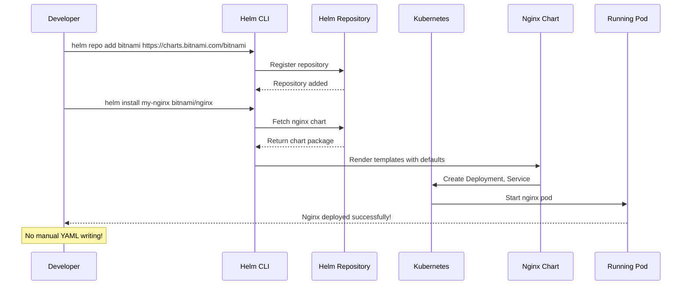
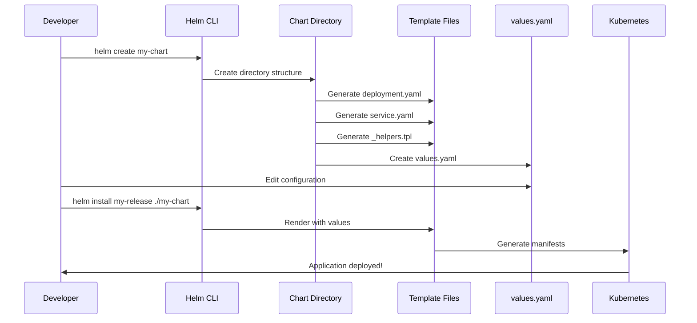
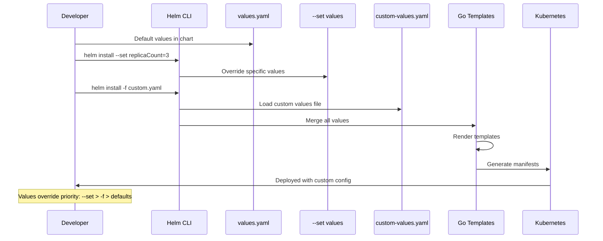
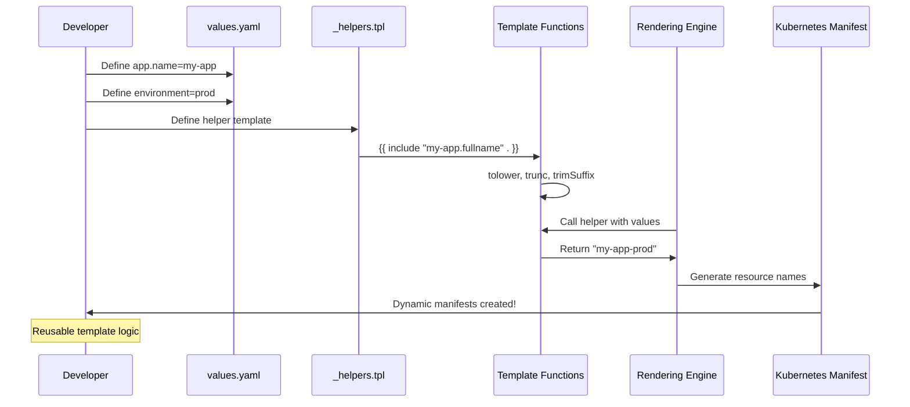
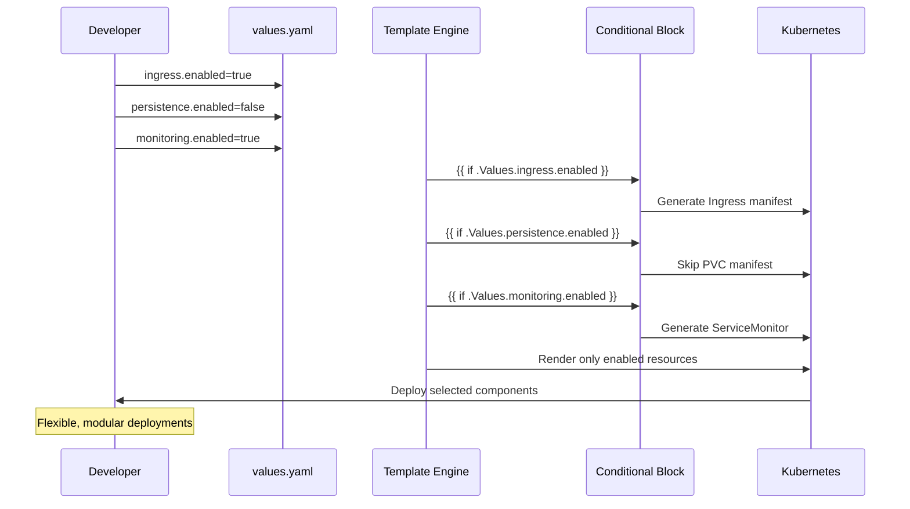
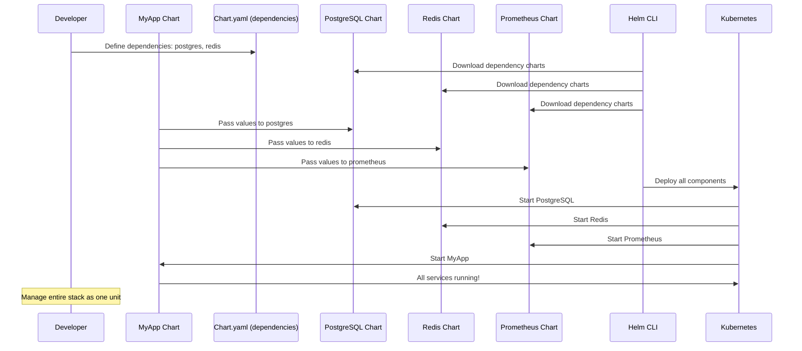
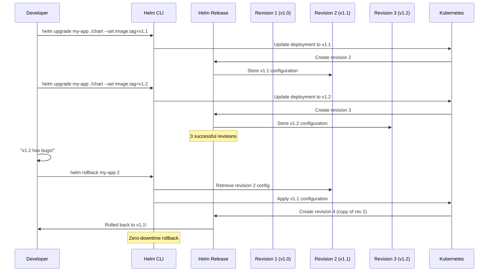
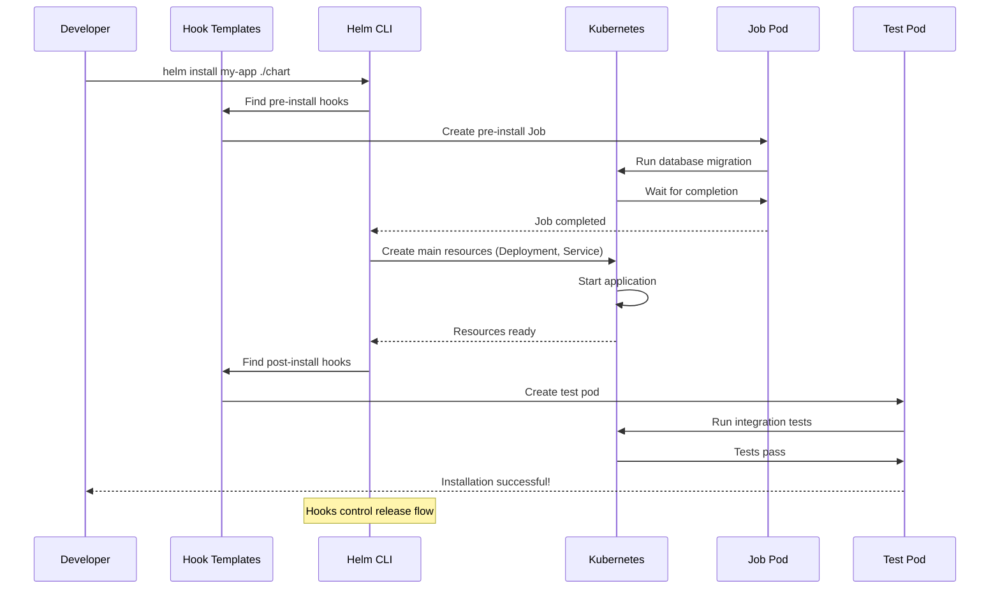
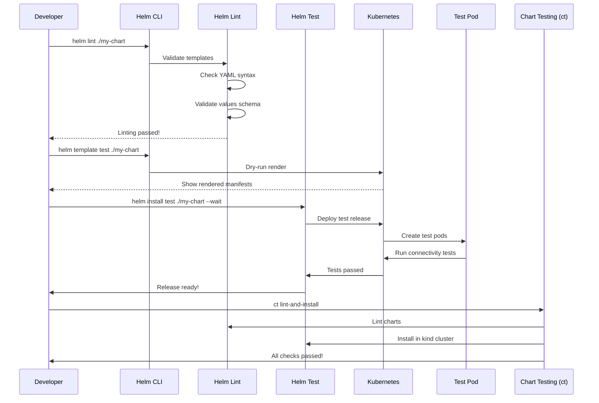
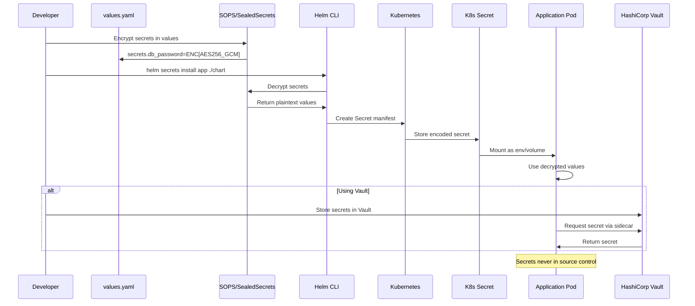

# Helm Complete Master Guide

Helm is the package manager for Kubernetes, allowing you to define, install, and upgrade complex K8s applications using reusable charts.

---

## Installation Guide

### **Windows**

```bash
# Using Chocolatey
choco install kubernetes-helm

# Using Scoop
scoop install helm

# Or download directly from GitHub
# Visit https://github.com/helm/helm/releases
```

### **macOS**

```bash
# Using Homebrew
brew install helm

# Using MacPorts
sudo port install helm
```

### **Linux**

```bash
# Download and install
curl https://baltocdn.com/helm/signing.asc | sudo apt-key add -
echo "deb https://baltocdn.com/helm/stable/debian/ all main" | sudo tee /etc/apt/sources.list.d/helm-stable-debian.list
sudo apt update
sudo apt install helm

# Or use installation script
curl -fsSL -o get_helm.sh https://raw.githubusercontent.com/helm/helm/main/scripts/get-helm-3
chmod 700 get_helm.sh
./get_helm.sh
```

### **Verify Installation**

```bash
helm version --short
helm completion bash  # Enable shell autocompletion
```

---

## BEGINNER LEVEL: First Steps with Helm

### **Scenario 1: Installing Your First Chart**

*Deploying an application from Helm Hub*



**Code:**

```bash
# Add a Helm chart repository
helm repo add bitnami https://charts.bitnami.com/bitnami
helm repo add stable https://charts.helm.sh/stable

# Update repository index
helm repo update

# Search for charts
helm search repo nginx

# Install a chart (creates a "release")
helm install my-nginx bitnami/nginx

# List installed releases
helm list
# OR
helm ls

# Check release status
helm status my-nginx

# View release history
helm history my-nginx

# Uninstall the release
helm uninstall my-nginx

# Add multiple repositories
helm repo add jetstack https://charts.jetstack.io
helm repo add prometheus-community https://prometheus-community.github.io/helm-charts

# View repositories
helm repo list

# Remove a repository
helm repo remove stable
```

---

### **Scenario 2: Creating Your First Helm Chart**

*Scaffolding a new chart from scratch*



**Code:**

```bash
# Create a new Helm chart
helm create my-first-chart

# Explore the directory structure
tree my-first-chart
# Output:
# my-first-chart/
# ├── Chart.yaml          # Chart metadata
# ├── values.yaml         # Default configuration values
# ├── charts/            # Dependencies
# └── templates/         # Manifest templates
#     ├── NOTES.txt      # Post-install notes
#     ├── _helpers.tpl   # Template helpers
#     ├── deployment.yaml
#     ├── service.yaml
#     ├── ingress.yaml
#     └── tests/         # Test files

# View the generated Chart.yaml
cat my-first-chart/Chart.yaml
# apiVersion: v2
# name: my-first-chart
# description: A Helm chart for Kubernetes
# type: application
# version: 0.1.0
# appVersion: "1.16.0"

# View default values
cat my-first-chart/values.yaml

# Deploy your new chart
helm install my-app ./my-first-chart

# Check what was created
kubectl get pods,svc,deploy -l app.kubernetes.io/name=my-first-chart

# Clean up
helm uninstall my-app
```

---

### **Scenario 3: Understanding Values & Overrides**

*Customizing chart behavior without modifying templates*



**Code:**

```bash
# View chart's default values
helm show values bitnami/nginx

# Install with --set overrides
helm install my-nginx bitnami/nginx \
  --set replicaCount=3 \
  --set service.type=NodePort \
  --set service.nodePort=30080

# Install with multiple --set (comma separated)
helm install my-nginx bitnami/nginx \
  --set replicaCount=3,service.type=LoadBalancer,image.tag=1.25

# Create custom values file
cat > my-values.yaml << 'EOF'
replicaCount: 5
service:
  type: LoadBalancer
  port: 80
  annotations:
    service.beta.kubernetes.io/aws-load-balancer-type: nlb
ingress:
  enabled: true
  hostname: myapp.example.com
resources:
  limits:
    cpu: 500m
    memory: 512Mi
  requests:
    cpu: 250m
    memory: 256Mi
EOF

# Install with custom values file
helm install my-nginx bitnami/nginx -f my-values.yaml

# Upgrade with new values
helm upgrade my-nginx bitnami/nginx -f new-values.yaml

# Get computed values for a release
helm get values my-nginx

# Get all values (including defaults)
helm get values my-nginx --all

# Override nested values
helm install my-nginx bitnami/nginx \
  --set "ingress.annotations.kubernetes\.io/ingress\.class=nginx"

# Set array values
helm install my-app ./my-chart \
  --set "env[0].name=ENV1,env[0].value=test"
```

---

### **Scenario 4: Template Functions & Pipelines**

*Using Helm's built-in functions to create dynamic templates*



**Code:**

```bash
# Create a chart with template helpers
helm create template-demo

# Edit templates/_helpers.tpl
cat > template-demo/templates/_helpers.tpl << 'EOF'
{{/*
Expand the name of the chart.
*/}}
{{- define "template-demo.name" -}}
{{- default .Chart.Name .Values.nameOverride | trunc 63 | trimSuffix "-" }}
{{- end }}

{{/*
Create a default fully qualified app name.
*/}}
{{- define "template-demo.fullname" -}}
{{- if .Values.fullnameOverride }}
{{- .Values.fullnameOverride | trunc 63 | trimSuffix "-" }}
{{- else }}
{{- $name := default .Chart.Name .Values.nameOverride }}
{{- if contains $name .Release.Name }}
{{- .Release.Name | trunc 63 | trimSuffix "-" }}
{{- else }}
{{- printf "%s-%s" .Release.Name $name | trunc 63 | trimSuffix "-" }}
{{- end }}
{{- end }}
{{- end }}

{{/*
Create chart name and version as used by the chart label.
*/}}
{{- define "template-demo.chart" -}}
{{- printf "%s-%s" .Chart.Name .Chart.Version | replace "+" "_" | trunc 63 | trimSuffix "-" }}
{{- end }}

{{/*
Common labels
*/}}
{{- define "template-demo.labels" -}}
helm.sh/chart: {{ include "template-demo.chart" . }}
{{ include "template-demo.selectorLabels" . }}
{{- if .Chart.AppVersion }}
app.kubernetes.io/version: {{ .Chart.AppVersion | quote }}
{{- end }}
app.kubernetes.io/managed-by: {{ .Release.Service }}
{{- end }}

{{/*
Selector labels
*/}}
{{- define "template-demo.selectorLabels" -}}
app.kubernetes.io/name: {{ include "template-demo.name" . }}
app.kubernetes.io/instance: {{ .Release.Name }}
{{- end }}

{{/*
Create the name of the service account to use
*/}}
{{- define "template-demo.serviceAccountName" -}}
{{- if .Values.serviceAccount.create }}
{{- default (include "template-demo.fullname" .) .Values.serviceAccount.name }}
{{- else }}
{{- default "default" .Values.serviceAccount.name }}
{{- end }}
{{- end }}
EOF

# Use helpers in deployment.yaml
cat > template-demo/templates/deployment.yaml << 'EOF'
apiVersion: apps/v1
kind: Deployment
metadata:
  name: {{ include "template-demo.fullname" . }}
  labels:
    {{- include "template-demo.labels" . | nindent 4 }}
spec:
  replicas: {{ .Values.replicaCount }}
  selector:
    matchLabels:
      {{- include "template-demo.selectorLabels" . | nindent 6 }}
  template:
    metadata:
      labels:
        {{- include "template-demo.selectorLabels" . | nindent 8 }}
    spec:
      containers:
      - name: {{ .Chart.Name }}
        image: "{{ .Values.image.repository }}:{{ .Values.image.tag }}"
        imagePullPolicy: {{ .Values.image.pullPolicy }}
        env:
        - name: POD_NAME
          valueFrom:
            fieldRef:
              fieldPath: metadata.name
        - name: NAMESPACE
          valueFrom:
            fieldRef:
              fieldPath: metadata.namespace
EOF

# Deploy the chart
helm install template-test ./template-demo

# View rendered templates without installing
helm template test-release ./template-demo

# View a specific template
helm template test-release ./template-demo --show-only templates/deployment.yaml

# Debug template rendering
helm install debug-test ./template-demo --dry-run --debug
```

---

### **Scenario 5: Conditional Resources**

*Creating optional components based on values*



**Code:**

```bash
# Create chart with conditional resources
helm create conditional-chart

# Edit values.yaml
cat > conditional-chart/values.yaml << 'EOF'
replicaCount: 1
image:
  repository: nginx
  tag: stable
  pullPolicy: IfNotPresent

service:
  type: ClusterIP
  port: 80

ingress:
  enabled: false
  className: nginx
  hosts:
    - host: chart-example.local
      paths:
        - path: /
          pathType: Prefix

persistence:
  enabled: true
  size: 10Gi

monitoring:
  enabled: false
EOF

# Create conditional ingress template
cat > conditional-chart/templates/ingress.yaml << 'EOF'
{{- if .Values.ingress.enabled -}}
{{- $fullName := include "conditional-chart.fullname" . -}}
{{- $svcPort := .Values.service.port -}}
apiVersion: networking.k8s.io/v1
kind: Ingress
metadata:
  name: {{ $fullName }}
  labels:
    {{- include "conditional-chart.labels" . | nindent 4 }}
  {{- if .Values.ingress.annotations }}
  annotations:
    {{- toYaml .Values.ingress.annotations | nindent 4 }}
  {{- end }}
spec:
  {{- if .Values.ingress.className }}
  ingressClassName: {{ .Values.ingress.className }}
  {{- end }}
  rules:
    {{- range .Values.ingress.hosts }}
    - host: {{ .host | quote }}
      http:
        paths:
          {{- range .paths }}
          - path: {{ .path }}
            pathType: {{ .pathType }}
            backend:
              service:
                name: {{ $fullName }}
                port:
                  number: {{ $svcPort }}
          {{- end }}
    {{- end }}
{{- end }}
EOF

# Create conditional PVC template
cat > conditional-chart/templates/pvc.yaml << 'EOF'
{{- if .Values.persistence.enabled }}
apiVersion: v1
kind: PersistentVolumeClaim
metadata:
  name: {{ include "conditional-chart.fullname" . }}-pvc
spec:
  accessModes:
    - ReadWriteOnce
  resources:
    requests:
      storage: {{ .Values.persistence.size }}
{{- end }}
EOF

# Create optional ServiceMonitor
cat > conditional-chart/templates/servicemonitor.yaml << 'EOF'
{{- if .Values.monitoring.enabled }}
apiVersion: monitoring.coreos.com/v1
kind: ServiceMonitor
metadata:
  name: {{ include "conditional-chart.fullname" . }}
spec:
  selector:
    matchLabels:
      {{- include "conditional-chart.selectorLabels" . | nindent 6 }}
  endpoints:
  - port: metrics
{{- end }}
EOF

# Test with different value combinations
helm template test ./conditional-chart --set ingress.enabled=true
helm template test ./conditional-chart --set persistence.enabled=false
helm install conditional-test ./conditional-chart \
  --set ingress.enabled=true \
  --set monitoring.enabled=true

# Clean up
helm uninstall conditional-test
```

---

### **Scenario 6: Chart Dependencies**

*Managing applications that require other services*



**Code:**

```bash
# Create a chart with dependencies
helm create app-stack

# Edit Chart.yaml to add dependencies
cat > app-stack/Chart.yaml << 'EOF'
apiVersion: v2
name: app-stack
description: A full application stack with PostgreSQL and Redis
type: application
version: 0.1.0
appVersion: "1.16.0"

dependencies:
- name: postgresql
  version: "12.1.2"
  repository: "https://charts.bitnami.com/bitnami"
  condition: postgresql.enabled
  tags:
    - database
- name: redis
  version: "17.4.3"
  repository: "https://charts.bitnami.com/bitnami"
  condition: redis.enabled
- name: common
  version: "2.2.0"
  repository: "https://charts.bitnami.com/bitnami"
  tags:
    - bitnami-common
EOF

# Update dependencies (downloads charts)
helm dependency update ./app-stack

# View dependency tree
helm dependency list ./app-stack

# Build dependencies (creates charts/ directory)
helm dependency build ./app-stack

# Create values file for dependencies
cat > app-stack/values.yaml << 'EOF'
# Application configuration
replicaCount: 2
image:
  repository: my-app
  tag: latest

# PostgreSQL dependency configuration
postgresql:
  enabled: true
  auth:
    username: myuser
    password: mypassword
    database: myappdb
  persistence:
    size: 10Gi

# Redis dependency configuration
redis:
  enabled: true
  auth:
    enabled: true
    password: redispassword
  master:
    persistence:
      enabled: true
      size: 8Gi
EOF

# Install with dependencies
helm install full-stack ./app-stack

# Check all resources
kubectl get pods

# Uninstall everything
helm uninstall full-stack

# Skip dependencies during install
helm install app-only ./app-stack --skip-dependencies

# Add alias for dependency
cat > app-stack/Chart.yaml << 'EOF'
dependencies:
- name: postgresql
  version: "12.1.2"
  repository: "https://charts.bitnami.com/bitnami"
  alias: primarydb
EOF

# Reference aliased dependency
helm template test ./app-stack --set primarydb.auth.password=secret
```

---

### **Scenario 7: Upgrading and Rolling Back**

*Managing chart updates safely*



**Code:**

```bash
# Install initial version
helm install my-app ./my-chart --set image.tag=v1.0

# Check release history
helm history my-app

# Upgrade to new version
helm upgrade my-app ./my-chart --set image.tag=v1.1

# Check the rollout status
helm status my-app

# View all revisions
helm history my-app
# Output shows:
# REVISION	UPDATED                 	STATUS    	CHART             	APP VERSION	DESCRIPTION
# 1        Thu Nov 30 10:00:00 2024	deployed  	my-chart-0.1.0    	1.16.0     	Install complete
# 2        Thu Nov 30 10:15:00 2024	superseded	my-chart-0.1.0    	1.16.0     	Upgrade complete

# Upgrade with values file
echo "image:\n  tag: v1.2" > upgrade-values.yaml
helm upgrade my-app ./my-chart -f upgrade-values.yaml

# Simulate a failed upgrade with --wait
helm upgrade my-app ./my-chart --set image.tag=v2.0 --wait --timeout=300s

# Check current release values
helm get values my-app

# Check all computed values
helm get values my-app --all

# Rollback to previous revision
helm rollback my-app 1

# Rollback to specific revision
helm rollback my-app 2

# Check rollback status
helm history my-app

# Force upgrade (recreate resources)
helm upgrade my-app ./my-chart --set image.tag=v3.0 --force

# Atomic upgrade (rollback on failure)
helm upgrade my-app ./my-chart --set image.tag=v3.0 --atomic

# Upgrade with dry-run
helm upgrade my-app ./my-chart --set image.tag=v4.0 --dry-run --debug

# Clean up
helm uninstall my-app
```

---

### **Scenario 8: Helm Hooks & Lifecycle Control**

*Running jobs at specific points in the release lifecycle*



**Code:**

```bash
# Create a chart with hooks
helm create hook-demo

# Pre-install hook: Database migration
cat > hook-demo/templates/pre-install-job.yaml << 'EOF'
apiVersion: batch/v1
kind: Job
metadata:
  name: {{ .Release.Name }}-db-migrate
  annotations:
    "helm.sh/hook": pre-install,pre-upgrade
    "helm.sh/hook-weight": "-5"
    "helm.sh/hook-delete-policy": hook-succeeded
spec:
  template:
    spec:
      restartPolicy: Never
      containers:
      - name: db-migrate
        image: busybox
        command: ['sh', '-c', 'echo "Running database migration..." && sleep 5 && echo "Migration complete!"']
EOF

# Post-install hook: Send notification
cat > hook-demo/templates/post-install-job.yaml << 'EOF'
apiVersion: batch/v1
kind: Job
metadata:
  name: {{ .Release.Name }}-notify
  annotations:
    "helm.sh/hook": post-install,post-upgrade
    "helm.sh/hook-weight": "5"
    "helm.sh/hook-delete-policy": before-hook-creation
spec:
  template:
    spec:
      restartPolicy: Never
      containers:
      - name: notify
        image: curlimages/curl
        command: ['sh', '-c', 'echo "Sending deployment notification..." && curl -X POST https://hooks.slack.com/services/XXX']
EOF

# Test hook: Validate deployment
cat > hook-demo/templates/tests/test-connection.yaml << 'EOF'
apiVersion: v1
kind: Pod
metadata:
  name: {{ .Release.Name }}-test
  annotations:
    "helm.sh/hook": test
spec:
  containers:
  - name: test
    image: busybox
    command: ['wget', '--spider', '{{ .Release.Name }}-hook-demo:80']
  restartPolicy: Never
EOF

# Install with hooks
helm install hooked-app ./hook-demo --wait

# View hook status
kubectl get jobs

# View hook pods (before they're deleted)
kubectl get pods -l helm.sh/hook

# Run tests manually
helm test hooked-app

# View test results
kubectl logs hooked-app-test

# Hook weights control execution order
cat > hook-demo/templates/pre-install-secret.yaml << 'EOF'
apiVersion: v1
kind: Secret
metadata:
  name: {{ .Release.Name }}-secret
  annotations:
    "helm.sh/hook": pre-install
    "helm.sh/hook-weight": "-10"  # Run first
type: Opaque
stringData:
  secret: {{ .Values.secret | default "default-secret" }}
EOF

# Hook delete policies
# before-hook-creation: Delete previous hook before new one
# hook-succeeded: Delete hook after success
# hook-failed: Keep hook if it fails
# helm.sh/hook-delete-policy: "before-hook-creation,hook-succeeded"

# Available hooks:
# pre-install: After rendering, before resources created
# post-install: After all resources created
# pre-delete: Before deletion starts
# post-delete: After deletion completes
# pre-upgrade: After upgrade rendering, before update
# post-upgrade: After upgrade completes
# pre-rollback: Before rollback starts
# post-rollback: After rollback completes
# test: Run helm test command

helm uninstall hooked-app
```

---

### **Scenario 9: Chart Testing**

*Validating charts before deployment*



**Code:**

```bash
# Lint your chart for errors
helm lint ./my-chart

# Lint with strict mode
helm lint ./my-chart --strict

# Dry run template rendering
helm template my-app ./my-chart

# Render with specific values
helm template my-app ./my-chart -f values.yaml --set replicaCount=3

# Validate against Kubernetes cluster
helm template my-app ./my-chart --validate

# Install in test namespace
helm install my-app-test ./my-chart --namespace test --create-namespace

# Run tests
helm test my-app-test

# Create test pod (automatically created by helm create)
cat > my-chart/templates/tests/test-connection.yaml << 'EOF'
apiVersion: v1
kind: Pod
metadata:
  name: "{{ .Release.Name }}-test-connection"
  annotations:
    "helm.sh/hook": test
spec:
  containers:
  - name: wget
    image: busybox
    command: ['wget']
    args: ['{{ .Release.Name }}-my-chart:80']
  restartPolicy: Never
EOF

# Run specific tests only
helm test my-app-test --filter name=my-app-test-test-connection

# Use Chart Testing (ct) tool
# Install: brew install chart-testing

# Lint and test charts
ct lint-and-install --charts ./my-chart

# Lint only changed charts (CI/CD)
ct lint --target-branch main

# Test using kind cluster
ct install --target-branch main

# Debug failing tests
kubectl logs my-app-test-test-connection -n test

# Use helm unittest plugin
# Install: helm plugin install https://github.com/helm-unittest/helm-unittest

# Create unit test
cat > my-chart/tests/deployment_test.yaml << 'EOF'
suite: test deployment
templates:
  - deployment.yaml
tests:
  - it: should have 3 replicas
    values:
      - ./values.yaml
    asserts:
      - equal:
          path: spec.replicas
          value: 3
  - it: should use correct image
    set:
      image.tag: v1.2.3
    asserts:
      - equal:
          path: spec.template.spec.containers[0].image
          value: nginx:v1.2.3
EOF

# Run unit tests
helm unittest ./my-chart

# Clean up
helm uninstall my-app-test --namespace test
kubectl delete namespace test
```

---

## INTERMEDIATE LEVEL: Advanced Templating & Patterns

### **Scenario 10: Range Loops & Conditionals**

*Generating multiple resources dynamically*

```mermaid
sequenceDiagram
    participant Dev as Developer
    participant Values as values.yaml
    participant Tpl as Go Templates
    participants Services as Service Array
    participant Ingress as Ingress Resources
    participant K8s as Kubernetes
    Dev->>Values: Define services array
    Values->>Services: [api, web, db]
    Tpl->>Services: {{ range .Values.services }}
    loop For each service
        Tpl->>K8s: Generate Deployment
        Tpl->>K8s: Generate Service
    end
    K8s->>K8s: 3 deployments, 3 services
    Dev->>Values: Define ingress.rules
    Values->>Ingress: Array of host/path rules
    Tpl->>Ingress: {{ range .Values.ingress.rules }}
    loop For each rule
        Tpl->>K8s: Generate Ingress path
    end
    K8s->>User: Dynamic resources created
    Note over Dev: DRY - Don't Repeat Yourself
```

**Code:**

```bash
# Create chart with loops
helm create dynamic-resources

# Edit values.yaml with array
cat > dynamic-resources/values.yaml << 'EOF'
replicaCount: 1
image:
  repository: nginx
  tag: latest

services:
  - name: api
    port: 3000
    type: ClusterIP
  - name: web
    port: 80
    type: LoadBalancer
  - name: admin
    port: 8080
    type: ClusterIP

ingress:
  enabled: true
  rules:
    - host: api.example.com
      path: /api
      service: api
      port: 3000
    - host: www.example.com
      path: /
      service: web
      port: 80
    - host: admin.example.com
      path: /
      service: admin
      port: 8080
EOF

# Create deployment per service
cat > dynamic-resources/templates/deployments.yaml << 'EOF'
{{- range .Values.services }}
---
apiVersion: apps/v1
kind: Deployment
metadata:
  name: {{ include "dynamic-resources.fullname" $ }}-{{ .name }}
  labels:
    {{- include "dynamic-resources.labels" $ | nindent 4 }}
    service: {{ .name }}
spec:
  replicas: {{ $.Values.replicaCount }}
  selector:
    matchLabels:
      {{- include "dynamic-resources.selectorLabels" $ | nindent 6 }}
      service: {{ .name }}
  template:
    metadata:
      labels:
        {{- include "dynamic-resources.selectorLabels" $ | nindent 8 }}
        service: {{ .name }}
    spec:
      containers:
      - name: {{ .name }}
        image: "{{ $.Values.image.repository }}:{{ $.Values.image.tag }}"
        ports:
        - containerPort: {{ .port }}
EOF

# Create service per service definition
cat > dynamic-resources/templates/services.yaml << 'EOF'
{{- range .Values.services }}
---
apiVersion: v1
kind: Service
metadata:
  name: {{ include "dynamic-resources.fullname" $ }}-{{ .name }}
  labels:
    {{- include "dynamic-resources.labels" $ | nindent 4 }}
spec:
  type: {{ .type }}
  ports:
  - port: {{ .port }}
    targetPort: {{ .port }}
    protocol: TCP
    name: {{ .name }}
  selector:
    {{- include "dynamic-resources.selectorLabels" $ | nindent 4 }}
    service: {{ .name }}
{{- end }}
EOF

# Create ingress with dynamic rules
cat > dynamic-resources/templates/ingress.yaml << 'EOF'
{{- if .Values.ingress.enabled }}
apiVersion: networking.k8s.io/v1
kind: Ingress
metadata:
  name: {{ include "dynamic-resources.fullname" . }}
spec:
  rules:
  {{- range .Values.ingress.rules }}
  - host: {{ .host }}
    http:
      paths:
      - path: {{ .path }}
        pathType: Prefix
        backend:
          service:
            name: {{ include "dynamic-resources.fullname" $ }}-{{ .service }}
            port:
              number: {{ .port }}
  {{- end }}
{{- end }}
EOF

# Test rendering
helm template dynamic-test ./dynamic-resources

# Install
helm install dynamic-app ./dynamic-resources

# Verify multiple deployments
kubectl get deployments
kubectl get services

# Use conditionals with range
cat > dynamic-resources/templates/rbac.yaml << 'EOF'
{{- if .Values.rbac.create -}}
{{- range .Values.rbac.roles }}
---
apiVersion: rbac.authorization.k8s.io/v1
kind: Role
metadata:
  name: {{ include "dynamic-resources.fullname" $ }}-{{ .name }}
rules:
{{- toYaml .rules | nindent 0 }}
{{- end }}
{{- end }}
EOF

# Clean up
helm uninstall dynamic-app
```

---

### **Scenario 11: Named Templates & Blocks**

*Reusable template components*

```mermaid
sequenceDiagram
    participant Dev as Developer
    participant Define as {{ define "block" }}
    participant Template as _helpers.tpl
    participants Usage as {{ include "block" . }}
    participant Render as Rendering Engine
    participant Deploy as Deployment
    participant Service as Service
    participant Ingress as Ingress
    Dev->>Define: Define named template
    Define->>Template: Store in _helpers.tpl
    Dev->>Usage: Use in deployment.yaml
    Dev->>Usage: Use in service.yaml
    Dev->>Usage: Use in ingress.yaml
    Usage->>Render: Include template
    Render->>Deploy: Apply labels
    Render->>Service: Apply same labels
    Render->>Ingress: Apply same labels
    Deploy->>K8s: Consistent labeling
    Note over Dev: Single source of truth
```

**Code:**

```bash
# Create shared templates
helm create shared-templates

# Create shared volume mount template
cat > shared-templates/templates/_volumes.tpl << 'EOF'
{{/* Define a persistent volume claim template */}}
{{- define "shared-templates.pvc" -}}
{{- if .Values.persistence.enabled -}}
apiVersion: v1
kind: PersistentVolumeClaim
metadata:
  name: {{ include "shared-templates.fullname" . }}-pvc
spec:
  accessModes:
    - {{ .Values.persistence.accessMode }}
  resources:
    requests:
      storage: {{ .Values.persistence.size }}
{{- if .Values.persistence.storageClass }}
  storageClassName: {{ .Values.persistence.storageClass }}
{{- end }}
{{- end -}}
{{- end -}}

{{/* Define volume mount for deployment */}}
{{- define "shared-templates.volumeMounts" -}}
{{- if .Values.persistence.enabled }}
volumeMounts:
- name: data
  mountPath: {{ .Values.persistence.mountPath }}
{{- end }}
{{- end -}}

{{/* Define volumes for deployment */}}
{{- define "shared-templates.volumes" -}}
{{- if .Values.persistence.enabled }}
volumes:
- name: data
  persistentVolumeClaim:
    claimName: {{ include "shared-templates.fullname" . }}-pvc
{{- end }}
{{- end -}}

{{/* Define environment variables template */}}
{{- define "shared-templates.env" -}}
{{- range .Values.env }}
- name: {{ .name }}
  value: {{ .value | quote }}
{{- end }}
{{- range .Values.envSecrets }}
- name: {{ .name }}
  valueFrom:
    secretKeyRef:
      name: {{ .secretName }}
      key: {{ .secretKey }}
{{- end }}
{{- end -}}

{{/* Define resources template */}}
{{- define "shared-templates.resources" -}}
{{- if .Values.resources }}
resources:
  {{- toYaml .Values.resources | nindent 2 }}
{{- else }}
resources: {}
{{- end }}
{{- end -}}
EOF

# Use named templates in deployment
cat > shared-templates/templates/deployment.yaml << 'EOF'
apiVersion: apps/v1
kind: Deployment
metadata:
  name: {{ include "shared-templates.fullname" . }}
spec:
  template:
    spec:
      containers:
      - name: {{ .Chart.Name }}
        image: "{{ .Values.image.repository }}:{{ .Values.image.tag }}"
        env:
          {{- include "shared-templates.env" . | nindent 10 }}
        {{- include "shared-templates.volumeMounts" . | nindent 8 }}
        {{- include "shared-templates.resources" . | nindent 8 }}
      {{- include "shared-templates.volumes" . | nindent 6 }}
EOF

# Create PVC using named template
cat > shared-templates/templates/pvc.yaml << 'EOF'
{{- include "shared-templates.pvc" . }}
EOF

# Use template composition
cat > shared-templates/templates/_composition.tpl << 'EOF'
{{/* Create a full application component */}}
{{- define "shared-templates.appComponent" -}}
{{- $top := index . 0 }}
{{- $component := index . 1 }}
---
apiVersion: apps/v1
kind: Deployment
metadata:
  name: {{ include "shared-templates.fullname" $top }}-{{ $component.name }}
spec:
  replicas: {{ $component.replicas | default 1 }}
  template:
    spec:
      containers:
      - name: {{ $component.name }}
        image: "{{ $component.image }}:{{ $component.tag }}"
        ports:
        - containerPort: {{ $component.port }}
---
apiVersion: v1
kind: Service
metadata:
  name: {{ include "shared-templates.fullname" $top }}-{{ $component.name }}
spec:
  ports:
  - port: {{ $component.port }}
    targetPort: {{ $component.port }}
  selector:
    app: {{ include "shared-templates.fullname" $top }}-{{ $component.name }}
{{- end -}}
EOF

# Use composition template
cat > shared-templates/templates/composed.yaml << 'EOF'
{{- range .Values.components }}
{{ include "shared-templates.appComponent" (list $ .) }}
{{- end }}
EOF

# Values file for composition
cat > shared-templates/values.yaml << 'EOF'
components:
  - name: api
    image: myapp/api
    tag: v1.0
    port: 3000
    replicas: 2
  - name: worker
    image: myapp/worker
    tag: v1.0
    port: 8080
    replicas: 1
EOF

# Render and install
helm template composition-test ./shared-templates
helm install composed-app ./shared-templates

# Clean up
helm uninstall composed-app
```

---

## ADVANCED LEVEL: Production-Ready Patterns

### **Scenario 12: Secrets Management & Integration**

*Securely handling sensitive data*



**Code:**

```bash
# Install helm-secrets plugin
helm plugin install https://github.com/jkroepke/helm-secrets

# Install sops
# macOS: brew install sops
# Linux: Download from https://github.com/mozilla/sops/releases

# Create .sops.yaml for encryption
cat > .sops.yaml << 'EOF'
creation_rules:
  - path_regex: secrets/.*
    age: "age1ql3z7hjy54pw3hyww5ayyfg7zqgvc7w3j2elw8zmrj2kg5sfn9aqmcac8p"
EOF

# Generate age key
age-keygen -o key.txt

# Create secret values file
cat > secrets.yaml << 'EOF'
secrets:
  database_password: supersecret
  api_key: secretapikey123
  jwt_secret: myjwtsecret
EOF

# Encrypt the file
sops -e secrets.yaml > secrets.enc.yaml

# Use encrypted values in Helm
helm secrets install my-app ./my-chart -f secrets.enc.yaml

# Decrypt during CI/CD
SOPS_AGE_KEY_FILE=key.txt helm secrets install my-app ./my-chart -f secrets.enc.yaml

# Alternative: SealedSecrets
# Install SealedSecrets controller
helm install sealed-secrets sealed-secrets/sealed-secrets

# Create sealed secret
kubectl create secret generic my-secret --from-literal=password=secret --dry-run=client -o yaml | kubeseal > my-chart/templates/sealed-secret.yaml

# Use in chart (no encryption keys needed)
cat > my-chart/templates/sealedsecret.yaml << 'EOF'
{{- if .Values.sealedSecrets.create }}
apiVersion: bitnami.com/v1alpha1
kind: SealedSecret
metadata:
  name: {{ .Release.Name }}-secrets
spec:
  encryptedData:
    DB_PASSWORD: {{ .Values.sealedSecrets.encryptedPassword }}
{{- end }}
EOF

# HashiCorp Vault integration
# Install vault injector
helm install vault hashicorp/vault

# Annotate pod for secret injection
cat > my-chart/templates/deployment-vault.yaml << 'EOF'
spec:
  template:
    metadata:
      annotations:
        vault.hashicorp.com/agent-inject: "true"
        vault.hashicorp.com/agent-inject-secret-db-creds: "secret/data/db"
        vault.hashicorp.com/agent-inject-template-db-creds: |
          {{- with secret "secret/data/db" -}}
          export DB_PASSWORD="{{ .Data.data.password }}"
          {{- end }}
        vault.hashicorp.com/role: "app-role"
EOF

# Use external-secrets operator
helm install external-secrets external-secrets/external-secrets

# Create ExternalSecret CRD
cat > my-chart/templates/externalsecret.yaml << 'EOF'
{{- if .Values.externalSecrets.enabled }}
apiVersion: external-secrets.io/v1beta1
kind: ExternalSecret
metadata:
  name: {{ .Release.Name }}-external-secret
spec:
  refreshInterval: 1h
  secretStoreRef:
    name: {{ .Values.externalSecrets.storeName }}
    kind: SecretStore
  target:
    name: {{ .Release.Name }}-secret
  data:
  - secretKey: password
    remoteRef:
      key: /prod/app/password
{{- end }}
EOF
```

---

### **Scenario 13: Release Management Strategies**

*Blue-Green and Canary deployments*

```mermaid
sequenceDiagram
    participant User as DevOps Engineer
    participant Helm as Helm CLI
    participant Blue as Blue Release (v1)
    participants Green as Green Release (v2)
    participants Canary as Canary Release (v3)
    participant Svc as Service
    participant Ingress as Ingress Controller
    User->>Helm: helm install app-blue ./chart --set version=v1
    Helm->>Blue: Deploy version 1 (100% traffic)
    Blue->>Svc: Register endpoints
    Svc->>Blue: User traffic 100%
    User->>Helm: helm install app-green ./chart --set version=v2
    Helm->>Green: Deploy version 2 (0% traffic)
    Green->>Green: Run smoke tests
    User->>Ingress: Switch traffic to green
    Ingress->>Green: 100% traffic
    Note over Green: Blue-Green complete
    alt Canary deployment
        User->>Helm: helm upgrade app-blue --set version=v3,replicas=1
        Helm->>Canary: Deploy version 3 (10% traffic)
        Ingress->>Canary: Traffic split: 90% v2, 10% v3
        User->>User: Monitor metrics
        User->>Helm: Scale canary to 100%
        Helm->>Canary: 100% traffic
    end
```

**Code:**

```bash
# Blue-Green Deployment Strategy
# Install blue environment (production)
helm install app-blue ./my-chart \
  --set image.tag=v1.0 \
  --set replicaCount=3 \
  --set service.suffix=blue \
  --set ingress.class=blue

# Install green environment (new version)
helm install app-green ./my-chart \
  --set image.tag=v2.0 \
  --set replicaCount=3 \
  --set service.suffix=green \
  --set ingress.class=green

# Test green environment
kubectl port-forward svc/app-green-my-chart 8080:80
curl http://localhost:8080

# Switch traffic using ingress annotation
cat > switch-to-green.yaml << 'EOF'
controller:
  service:
    annotations:
      service.beta.kubernetes.io/aws-load-balancer-backend-protocol: http
      nginx.ingress.kubernetes.io/canary: "true"
      nginx.ingress.kubernetes.io/canary-weight: "100"
EOF

helm upgrade app-green ./my-chart -f switch-to-green.yaml

# Delete blue after verification
helm uninstall app-blue

# Canary Deployment with Istio
# Install Istio
helm install istio-base istio/base
helm install istiod istio/istio-discovery

# Deploy canary version
helm install app-canary ./my-chart \
  --set image.tag=v2.0 \
  --set replicaCount=1 \
  --set canary.enabled=true

# Configure traffic splitting
cat > virtual-service.yaml << 'EOF'
apiVersion: networking.istio.io/v1alpha3
kind: VirtualService
metadata:
  name: app-canary
spec:
  hosts:
  - app.example.com
  http:
  - route:
    - destination:
        host: app-stable
      weight: 90
    - destination:
        host: app-canary
      weight: 10
EOF

kubectl apply -f virtual-service.yaml

# Gradually increase canary traffic
# Update VirtualService weight to 50/50
# Monitor metrics: error rate, latency
# Full promotion: 100% to canary
# Delete stable release

# Native Helm Canary with Helm Controller
# Install Helm Controller
helm install helm-controller helm/helm-controller

# Create HelmRelease with canary
cat > helmrelease-canary.yaml << 'EOF'
apiVersion: helm.cattle.io/v1
kind: HelmChart
metadata:
  name: app
  namespace: default
spec:
  chart: my-chart
  targetNamespace: default
  valuesContent: |-
    replicaCount: 3
    image:
      tag: v1.0
---
apiVersion: flagger.app/v1beta1
kind: Canary
metadata:
  name: app
spec:
  targetRef:
    apiVersion: helm.cattle.io/v1
    kind: HelmChart
    name: app
  service:
    port: 80
  analysis:
    interval: 1m
    threshold: 5
    maxWeight: 50
    stepWeight: 10
EOF
```

---

### **Scenario 14: Advanced Chart Patterns**

*Library charts and umbrella patterns*

```mermaid
sequenceDiagram
    participant Dev as Developer
    participant Lib as Library Chart
    participant Umbrella as Umbrella Chart
    participant Sub1 as Subchart 1 (API)
    participant Sub2 as Subchart 2 (Worker)
    participants Sub3 as Subchart 3 (Frontend)
    participants K8s as Kubernetes
    Dev->>Lib: Create library chart
    Lib->>Lib: Define reusable templates
    Dev->>Umbrella: Create umbrella chart
    Umbrella->>Sub1: Add as dependency
    Umbrella->>Sub2: Add as dependency
    Umbrella->>Sub3: Add as dependency
    Umbrella->>Umbrella: Override values
    Dev->>Helm: helm install platform ./umbrella
    Helm->>Lib: Include library templates
    Helm->>Sub1: Deploy API
    Helm->>Sub2: Deploy Worker
    Helm->>Sub3: Deploy Frontend
    Sub1->>K8s: API resources
    Sub2->>K8s: Worker resources
    Sub3->>K8s: Frontend resources
    K8s->>User: Full platform deployed
```

**Code:**

```bash
# Create a library chart
helm create common-lib

# Convert to library type
cat > common-lib/Chart.yaml << 'EOF'
apiVersion: v2
name: common-lib
description: Common library templates
type: library
version: 0.1.0
EOF

# Remove templates (library charts don't deploy resources)
rm -rf common-lib/templates/*.yaml

# Create reusable templates
cat > common-lib/templates/_deployment.tpl << 'EOF'
{{- define "common-lib.deployment" -}}
{{- $ := index . 0 }}
{{- $values := index . 1 }}
apiVersion: apps/v1
kind: Deployment
metadata:
  name: {{ include "common-lib.fullname" $ }}-{{ $values.name }}
spec:
  replicas: {{ $values.replicas }}
  selector:
    matchLabels:
      app: {{ include "common-lib.fullname" $ }}-{{ $values.name }}
  template:
    metadata:
      labels:
        app: {{ include "common-lib.fullname" $ }}-{{ $values.name }}
    spec:
      containers:
      - name: {{ $values.name }}
        image: "{{ $values.image }}:{{ $values.tag }}"
        ports:
        - containerPort: {{ $values.port }}
{{- end -}}
EOF

# Create helper for library
cat > common-lib/templates/_helpers.tpl << 'EOF'
{{- define "common-lib.fullname" -}}
{{- printf "%s-%s" .Release.Name .Chart.Name | trunc 63 | trimSuffix "-" }}
{{- end -}}
EOF

# Package library chart
helm package common-lib

# Create umbrella chart
helm create umbrella-platform

# Edit Chart.yaml for umbrella
cat > umbrella-platform/Chart.yaml << 'EOF'
apiVersion: v2
name: umbrella-platform
description: Full platform deployment
type: application
version: 1.0.0

dependencies:
- name: api
  version: "0.1.0"
  repository: "file://../api-chart"
- name: worker
  version: "0.1.0"
  repository: "file://../worker-chart"
- name: frontend
  version: "0.1.0"
  repository: "file://../frontend-chart"
- name: common-lib
  version: "0.1.0"
  repository: "file://../common-lib"
  import-values:
    - defaults
EOF

# Use library in subchart
# In api-chart/templates/deployment.yaml:
# {{ include "common-lib.deployment" (list . .Values.api) }}

# Create values for umbrella
cat > umbrella-platform/values.yaml << 'EOF'
api:
  replicas: 3
  image: myregistry/api
  tag: v1.0
  port: 3000

worker:
  replicas: 2
  image: myregistry/worker
  tag: v1.0
  port: 8080

frontend:
  replicas: 2
  image: myregistry/frontend
  tag: v1.0
  port: 80

global:
  environment: production
  domain: example.com
EOF

# Install umbrella chart
helm dependency update ./umbrella-platform
helm install platform ./umbrella-platform

# View all deployed components
helm list

# Upgrade specific component
helm upgrade platform ./umbrella-platform --set api.tag=v1.1

# Library chart advantages:
# 1. Share common templates across many charts
# 2. Version templates independently
# 3. Reduce duplication
# 4. Centralize maintenance

# Create helmignore file
cat > common-lib/.helmignore << 'EOF'
# Patterns to ignore when building packages.
.DS_Store
.git/
.gitignore
.vscode/
EOF

# Use template blocks for inheritance
cat > common-lib/templates/_base.tpl << 'EOF'
{{- define "common-lib.base.labels" }}
labels:
  app: {{ .Chart.Name }}
  release: {{ .Release.Name }}
{{- end -}}

{{- define "common-lib.base.metadata" }}
metadata:
  name: {{ .Release.Name }}-{{ .Values.component }}
  {{- include "common-lib.base.labels" . | nindent 2 }}
{{- end -}}
EOF

# In subchart:
# {{ define "myapp.deployment" }}
# {{ template "common-lib.base.metadata" . }}
# spec:
#   replicas: {{ .Values.replicas }}
# {{ end }}
```

---

### **Scenario 15: OCI Registry Support**

*Storing charts in container registries*

```mermaid
sequenceDiagram
    participant Dev as Developer
    participants Helm as Helm CLI
    participants Docker as Docker CLI
    participants OCI as OCI Registry (GHCR/ECR)
    participants Artifact as Helm Artifact
    participants K8s as Kubernetes
    Dev->>Helm: helm package ./my-chart
    Helm->>Artifact: Create .tgz package
    Dev->>Helm: helm registry login ghcr.io
    Helm->>OCI: Authenticate with token
    OCI-->>Helm: Login successful
    Dev->>Helm: helm push my-chart-0.1.0.tgz oci://ghcr.io/myorg
    Helm->>OCI: Upload chart artifact
    OCI->>Artifact: Store as OCI artifact
    Artifact-->>OCI: Stored with digest
    OCI-->>Helm: Push successful!
    Dev->>Helm: helm install my-app oci://ghcr.io/myorg/my-chart --version 0.1.0
    Helm->>OCI: Pull chart artifact
    OCI-->>Helm: Download chart
    Helm->>K8s: Deploy application
    Note over Dev: Treat charts like container images
```

**Code:**

```bash
# Enable OCI support (Helm 3.8+)
export HELM_EXPERIMENTAL_OCI=1

# Create and package chart
helm create oci-chart
helm package ./oci-chart

# Login to OCI registry
# GitHub Container Registry
echo $GITHUB_TOKEN | helm registry login ghcr.io -u $GITHUB_USER --password-stdin

# Amazon ECR
aws ecr get-login-password --region us-west-2 | helm registry login 123456789.dkr.ecr.us-west-2.amazonaws.com -u AWS --password-stdin

# Azure Container Registry
az acr login --name myregistry
# Helm uses Docker credentials

# Push chart to OCI registry
helm push oci-chart-0.1.0.tgz oci://ghcr.io/myorg

# Push with specific tag
helm push oci-chart-0.1.0.tgz oci://ghcr.io/myorg --version 0.1.0

# Install directly from OCI
helm install my-app oci://ghcr.io/myorg/oci-chart --version 0.1.0

# Pull chart locally
helm pull oci://ghcr.io/myorg/oci-chart --version 0.1.0 --untar

# List tags in OCI registry
# Using oras CLI
oras repo tags ghcr.io/myorg/oci-chart

# Sign charts with Cosign
# Install cosign: brew install cosign

# Sign the chart
cosign sign ghcr.io/myorg/oci-chart:0.1.0

# Verify signature
cosign verify ghcr.io/myorg/oci-chart:0.1.0 --certificate-identity-regexp '.*' --certificate-oidc-issuer-regexp '.*'

# Store in multiple registries
# Helm chartmuseum alternative
helm repo index . --url https://myorg.github.io/helm-charts
git add .
git commit -m "Release version 0.1.0"
git tag v0.1.0
git push origin main --tags

# Use GitHub Pages as Helm repository
# GitHub Actions workflow:
# .github/workflows/release.yml
cat > .github/workflows/release.yml << 'EOF'
name: Release Charts

on:
  push:
    tags:
      - 'v*'

jobs:
  release:
    runs-on: ubuntu-latest
    steps:
      - uses: actions/checkout@v3
      - name: Configure Git
        run: |
          git config user.name "$GITHUB_ACTOR"
          git config user.email "$GITHUB_ACTOR@users.noreply.github.com"
      - name: Run chart-releaser
        uses: helm/chart-releaser-action@v1.5.0
        env:
          CR_TOKEN: "${{ secrets.GITHUB_TOKEN }}"
EOF

# Integrate with GitOps
# Flux Helm Controller
cat > helmrelease.yaml << 'EOF'
apiVersion: helm.toolkit.fluxcd.io/v2beta1
kind: HelmRelease
metadata:
  name: my-app
spec:
  interval: 5m
  chart:
    spec:
      chart: oci-chart
      version: '0.1.0'
      sourceRef:
        kind: HelmRepository
        name: oci-registry
  values:
    replicaCount: 3
EOF
```

---

### **Scenario 16: Chart Debugging & Best Practices**

*Troubleshooting and production patterns*

```mermaid
sequenceDiagram
    participant Dev as Developer
    participants Helm as Helm CLI
    participants Lint as helm lint
    participants Template as helm template
    participants Debug as helm template --debug
    participants K8s as Kubernetes
    participants Pod as Debug Pod
    Dev->>Lint: helm lint ./chart
    Lint->>Dev: Report warnings/errors
    Dev->>Template: helm template test ./chart
    Template->>Dev: Show rendered YAML
    Dev->>Debug: helm template --debug --set image.tag=invalid
    Debug->>Dev: Show template context
    Dev->>Helm: helm install test ./chart --dry-run
    Helm->>K8s: Validate against cluster
    K8s->>Dev: Validation errors
    Dev->>Dev: Fix issues
    Dev->>Helm: helm install test ./chart
    Helm->>K8s: Deploy successfully
    Note over Dev: Follow best practices!
```

**Code:**

```bash
# Comprehensive linting
helm lint ./my-chart --strict --with-subcharts

# Debug template rendering
helm template debug ./my-chart --debug --set replicaCount=invalid

# Validate against cluster schema
helm template test ./my-chart --validate

# Check for deprecated APIs
helm template test ./my-chart | kubeconform -strict

# Trace template execution
helm template test ./my-chart --debug --execute templates/deployment.yaml

# Use fail function for validation
cat > my-chart/templates/_helpers.tpl << 'EOF'
{{- define "my-chart.validate" -}}
{{- if and .Values.persistence.enabled (not .Values.persistence.size) -}}
{{- fail "persistence.size is required when persistence is enabled" -}}
{{- end -}}
{{- end -}}

# Call in templates
{{ include "my-chart.validate" . }}
EOF

# Best practices checklist
cat > chart-best-practices.md << 'EOF'
# Helm Chart Best Practices

## Chart Structure
- Use proper semantic versioning (Chart.yaml version)
- Include README.md with usage instructions
- Add LICENSE file
- Use .helmignore to exclude unnecessary files
- Keep charts small and focused

## Values
- Use camelCase for values (not snake_case or kebab-case)
- Provide sensible defaults in values.yaml
- Use comments in values.yaml to document options
- Group related values (e.g., `postgresql.auth.password`)
- Use `global` values for cross-chart configuration

## Templates
- Use named templates for reusable blocks
- Use `include` not `template` (includes pipelining)
- Always quote strings in templates
- Use `nindent` for proper indentation
- Validate required values with `fail`
- Don't hardcode namespaces

## Security
- Never put secrets in values.yaml
- Use secrets management (SOPS, Vault, SealedSecrets)
- Define securityContexts in templates
- Use readOnlyRootFilesystem when possible
- Don't run containers as root

## Dependencies
- Pin dependency versions
- Use `condition` flags for optional deps
- Use `alias` for multiple instances
- Document dependency requirements

## Testing
- Add tests in templates/tests/
- Use helm unittest for unit tests
- Test upgrades, not just installs
- Test with different value combinations
- Include CI/CD pipeline tests

## Documentation
- Generate README.md from values.yaml
- Use helm-docs tool
- Document breaking changes
- Maintain CHANGELOG
- Include examples in values-test.yaml
EOF

# Use helm-docs to generate documentation
# Install: brew install norwoodj/tap/helm-docs
helm-docs -c ./my-chart

# Create values schema validation
cat > my-chart/values.schema.json << 'EOF'
{
  "$schema": "https://json-schema.org/draft-07/schema#",
  "properties": {
    "replicaCount": {
      "type": "integer",
      "minimum": 1,
      "maximum": 100
    },
    "image": {
      "properties": {
        "repository": {
          "type": "string",
          "pattern": "^[a-z0-9-/.]+$"
        },
        "tag": {
          "type": "string"
        }
      },
      "required": ["repository", "tag"]
    },
    "environment": {
      "type": "string",
      "enum": ["development", "staging", "production"]
    }
  },
  "required": ["image"]
}
EOF

# Validate values against schema
helm lint ./my-chart --values values-prod.yaml --strict

# Use pre-commit hooks
cat > .pre-commit-config.yaml << 'EOF'
repos:
- repo: https://github.com/gruntwork-io/pre-commit
  rev: v0.1.20
  hooks:
    - id: helmlint
EOF

# Install pre-commit
pip install pre-commit
pre-commit install

# Performance optimization
# Use --set-string for numeric strings
helm install test ./my-chart --set-string port="80"  # Not --set port=80

# Minimize chart size
du -h my-chart/
helm package my-chart --debug

# Use helm-s3 for private repositories
helm plugin install https://github.com/hypnoglow/helm-s3.git
helm repo add stable s3://my-helm-charts/stable
helm s3 push my-chart-0.1.0.tgz stable

# Clean up
helm uninstall test
```

---

## Quick Reference: Essential Commands

| Command                             | Description           | Level        |
| :---------------------------------- | :-------------------- | :----------- |
| `helm install <release> <chart>`  | Install a chart       | Beginner     |
| `helm list`                       | List releases         | Beginner     |
| `helm uninstall <release>`        | Delete a release      | Beginner     |
| `helm repo add <name> <url>`      | Add repository        | Beginner     |
| `helm create <name>`              | Create new chart      | Beginner     |
| `helm package <chart>`            | Package chart         | Beginner     |
| `helm upgrade <release> <chart>`  | Upgrade release       | Intermediate |
| `helm rollback <release> <rev>`   | Rollback to version   | Intermediate |
| `helm template <release> <chart>` | Render templates      | Intermediate |
| `helm dependency update`          | Update dependencies   | Intermediate |
| `helm lint <chart>`               | Lint chart            | Intermediate |
| `helm test <release>`             | Run tests             | Intermediate |
| `helm push <chart> <repo>`        | Push to registry      | Advanced     |
| `helm registry login <registry>`  | Login to OCI registry | Advanced     |
| `helm secrets <command>`          | Manage secrets        | Advanced     |
| `helm plugin install <url>`       | Install plugin        | Advanced     |

---

## Pro Tips for All Levels

1. **Always pin versions**: Use exact chart versions, not `latest`
2. **Use helm-secrets**: Never commit plain-text secrets
3. **Lint in CI/CD**: Add `helm lint` to your pipeline
4. **Test upgrades**: Always test `helm upgrade`, not just install
5. **Use --atomic**: On failed upgrades, automatically rollback
6. **Document values**: Comment every option in `values.yaml`
7. **Use semantic versioning**: Follow `MAJOR.MINOR.PATCH`
8. **Keep charts small**: One chart per microservice
9. **Use library charts**: Share common templates
10. **Validate with schema**: Add `values.schema.json`
11. **Use OCI registries**: Treat charts like container images
12. **Monitor releases**: Track `helm history` regularly
13. **Use pre-commit hooks**: Catch errors early
14. **Backup etcd**: Helm state is stored in Kubernetes
15. **Use Helmfile for multi-environment**: Manage complex deployments

Happy charting! 🎩
