# Kubernetes (K8s) Complete Master Guide

Kubernetes is a container orchestration platform that automates deployment, scaling, and management of containerized applications.

---

## Installation Guide

### **Install kubectl (Kubernetes CLI)**

**Windows:**
```bash
# Using Chocolatey
choco install kubernetes-cli

# Using Scoop
scoop install kubectl
```

**macOS:**
```bash
# Using Homebrew
brew install kubectl

# Using MacPorts
sudo port install kubectl
```

**Linux:**
```bash
# Download latest stable release
curl -LO "https://dl.k8s.io/release/$(curl -L -s https://dl.k8s.io/release/stable.txt)/bin/linux/amd64/kubectl"

# Install
sudo install -o root -g root -m 0755 kubectl /usr/local/bin/kubectl

# Verify
kubectl version --client
```

### **Install Minikube (Local Cluster)**

**Windows:**
```bash
choco install minikube
```

**macOS:**
```bash
brew install minikube
```

**Linux:**
```bash
curl -LO https://storage.googleapis.com/minikube/releases/latest/minikube-linux-amd64
sudo install minikube-linux-amd64 /usr/local/bin/minikube
```

### **Start Your Cluster**
```bash
# Start Minikube with recommended resources
minikube start --driver=docker --cpus=4 --memory=4096

# Verify cluster is running
kubectl cluster-info

# View nodes
kubectl get nodes

# Enable dashboard (optional)
minikube addons enable dashboard
minikube addons enable metrics-server
```

---

## BEGINNER LEVEL: First Steps with Kubernetes

### **Scenario 1: Exploring Your Cluster**
*Understanding the basic components of your Kubernetes cluster*

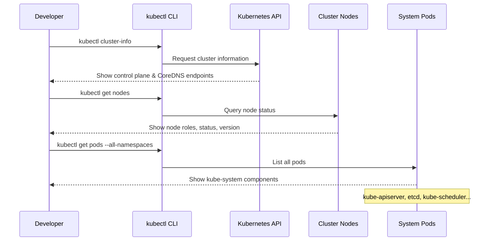

**Code:**
```bash
# Check cluster information
kubectl cluster-info

# Expected output:
# Kubernetes control plane is running at https://127.0.0.1:6443
# CoreDNS is running at https://127.0.0.1:6443/api/v1/namespaces/kube-system/services/kube-dns:dns/proxy

# View all nodes in the cluster
kubectl get nodes

# Get detailed node information
kubectl get nodes -o wide

# View all pods across all namespaces (system pods)
kubectl get pods --all-namespaces

# Check kubectl version (client and server)
kubectl version --short

# View current context
kubectl config current-context

# View all contexts
kubectl config get-contexts
```

---

### **Scenario 2: Running Your First Pod Imperatively**
*Creating a pod directly using kubectl run command*

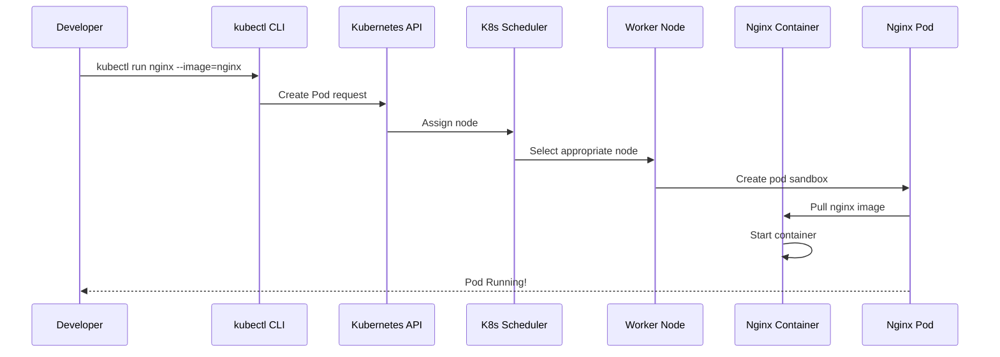

**Code:**
```bash
# Create a pod named nginx using nginx image
kubectl run nginx --image=nginx

# Check if pod is running
kubectl get pods

# Get more details about the pod
kubectl get pods -o wide

# Describe the pod to see events and status
kubectl describe pod nginx

# View logs of the pod
kubectl logs nginx

# Get an interactive shell inside the pod
kubectl exec -it nginx -- /bin/bash

# Inside the pod you can:
# ls -la
# cat /etc/nginx/nginx.conf
# exit

# Clean up - delete the pod
kubectl delete pod nginx
```

---

### **Scenario 3: Creating Pods Declaratively with YAML**
*Defining pods as code using YAML manifests*

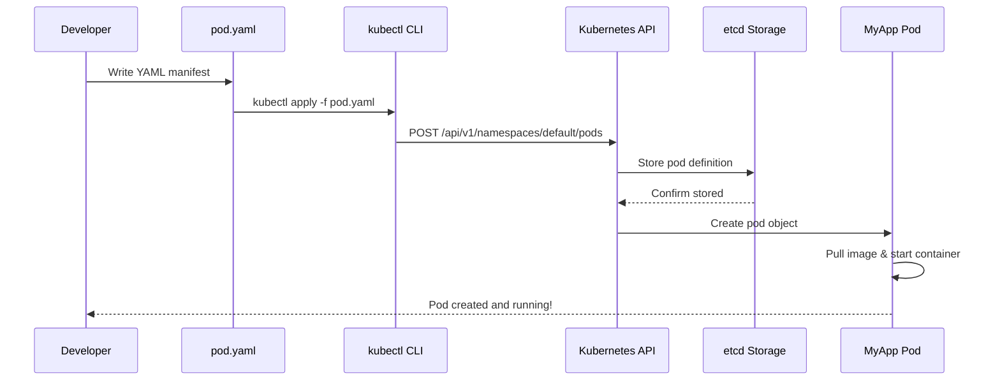

**Code:**
```bash
# Create a YAML file for a pod
cat > my-app-pod.yaml << 'EOF'
apiVersion: v1
kind: Pod
metadata:
  name: my-app-pod
  labels:
    app: my-application
    tier: frontend
spec:
  containers:
  - name: app-container
    image: nginx:latest
    ports:
    - containerPort: 80
      name: http
    env:
    - name: ENVIRONMENT
      value: "development"
EOF

# Create the pod from the YAML file
kubectl apply -f my-app-pod.yaml

# Verify the pod is created
kubectl get pods -l app=my-application

# Get detailed information
kubectl describe pod my-app-pod

# View pod in YAML format
kubectl get pod my-app-pod -o yaml

# Delete the pod using the file
kubectl delete -f my-app-pod.yaml

# Alternative: Delete by name
kubectl delete pod my-app-pod
```

---

### **Scenario 4: Exposing Pods with Services**
*Making pods accessible from outside or within the cluster*

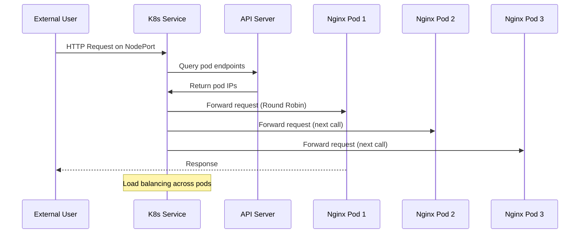

**Code:**
```bash
# Create multiple pods with same label
kubectl run nginx-1 --image=nginx --labels="app=webserver,tier=frontend"
kubectl run nginx-2 --image=nginx --labels="app=webserver,tier=frontend"
kubectl run nginx-3 --image=nginx --labels="app=webserver,tier=frontend"

# Expose pods as a service (ClusterIP - internal only)
kubectl expose pod nginx-1 --name=nginx-service --port=80 --target-port=80

# Or create service YAML
cat > nginx-service.yaml << 'EOF'
apiVersion: v1
kind: Service
metadata:
  name: nginx-service
spec:
  selector:
    app: webserver
    tier: frontend
  ports:
  - protocol: TCP
    port: 80
    targetPort: 80
  type: NodePort  # Makes it accessible outside cluster
EOF

kubectl apply -f nginx-service.yaml

# Get service information
kubectl get services

# Get the NodePort
kubectl get svc nginx-service

# Access the service
minikube service nginx-service --url

# View service endpoints (backends)
kubectl get endpoints nginx-service

# Clean up
kubectl delete service nginx-service
kubectl delete pod -l app=webserver
```

---

### **Scenario 5: Scaling with ReplicaSets**
*Ensuring desired number of pod replicas*

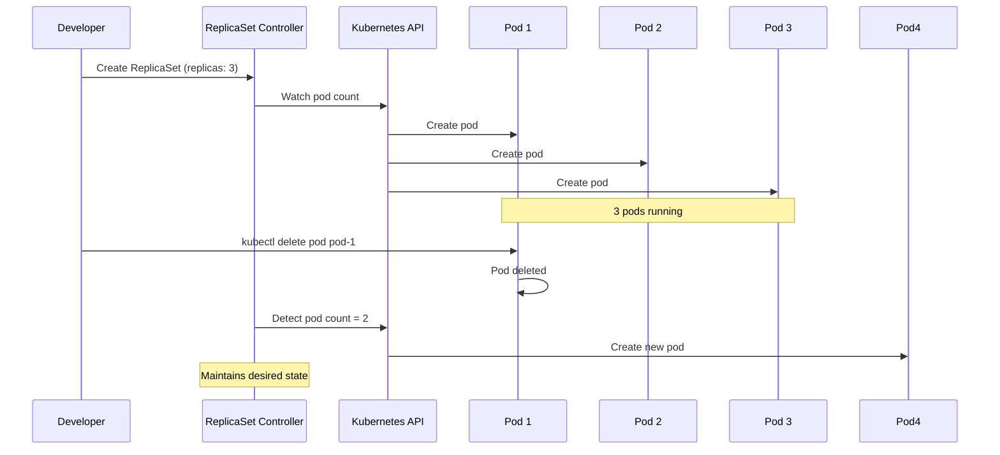

**Code:**
```bash
# Create a ReplicaSet YAML
cat > myapp-replicaset.yaml << 'EOF'
apiVersion: apps/v1
kind: ReplicaSet
metadata:
  name: myapp-replicaset
spec:
  replicas: 3
  selector:
    matchLabels:
      app: my-application
      tier: frontend
  template:
    metadata:
      labels:
        app: my-application
        tier: frontend
    spec:
      containers:
      - name: app-container
        image: nginx:latest
        ports:
        - containerPort: 80
        env:
        - name: ENVIRONMENT
          value: "production"
EOF

# Create the ReplicaSet
kubectl apply -f myapp-replicaset.yaml

# Check ReplicaSet status
kubectl get replicaset

# View pods created by ReplicaSet
kubectl get pods --show-labels

# Scale the ReplicaSet
kubectl scale replicaset myapp-replicaset --replicas=5

# Verify scaling
kubectl get pods

# Scale down
kubectl scale replicaset myapp-replicaset --replicas=2

# Delete a pod and watch ReplicaSet recreate it
kubectl delete pod -l app=my-application --grace-period=0 --force
kubectl get pods -w  # Watch recreation

# Clean up
kubectl delete replicaset myapp-replicaset
```

---

### **Scenario 6: Updating & Rolling Back with Deployments**
*Managing application updates seamlessly*

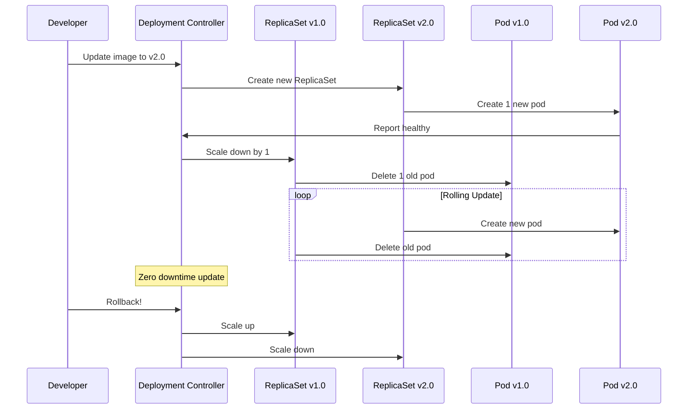

**Code:**
```bash
# Create a Deployment
cat > myapp-deployment.yaml << 'EOF'
apiVersion: apps/v1
kind: Deployment
metadata:
  name: myapp-deployment
spec:
  replicas: 3
  selector:
    matchLabels:
      app: my-application
  template:
    metadata:
      labels:
        app: my-application
    spec:
      containers:
      - name: app-container
        image: nginx:1.24  # Start with v1.24
        ports:
        - containerPort: 80
        env:
        - name: VERSION
          value: "1.0"
EOF

kubectl apply -f myapp-deployment.yaml

# Watch the rollout status
kubectl rollout status deployment/myapp-deployment

# Get Deployment details
kubectl get deployments
kubectl get pods

# Update to new version (imperative)
kubectl set image deployment/myapp-deployment app-container=nginx:1.25

# Or edit the deployment YAML directly
kubectl edit deployment myapp-deployment

# Watch the rolling update
kubectl get pods -w

# Check rollout history
kubectl rollout history deployment/myapp-deployment

# Rollback to previous version
kubectl rollout undo deployment/myapp-deployment

# Rollback to specific revision
kubectl rollout undo deployment/myapp-deployment --to-revision=2

# Pause and resume a rollout
kubectl rollout pause deployment/myapp-deployment
# Make multiple changes
kubectl rollout resume deployment/myapp-deployment

# Clean up
kubectl delete deployment myapp-deployment
```

---

## INTERMEDIATE LEVEL: Configuration & Storage

### **Scenario 7: ConfigMaps for Configuration**
*Separating configuration from container images*

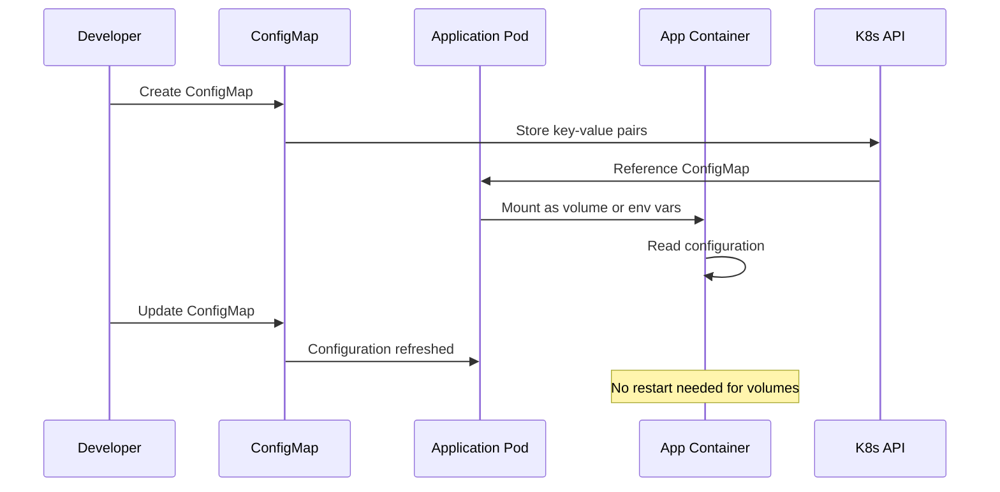

**Code:**
```bash
# Create ConfigMap imperatively
kubectl create configmap app-config \
  --from-literal=ENVIRONMENT=production \
  --from-literal=API_URL=https://api.example.com \
  --from-literal=LOG_LEVEL=info

# Create from file
echo "max_connections=100" > app.properties
kubectl create configmap app-config-file --from-file=app.properties

# Create from directory
mkdir config
echo "debug=false" > config/settings.env
kubectl create configmap app-config-dir --from-file=config/

# View ConfigMaps
kubectl get configmaps
kubectl describe configmap app-config

# Use ConfigMap as environment variables
cat > pod-with-configmap.yaml << 'EOF'
apiVersion: v1
kind: Pod
metadata:
  name: configmap-pod
spec:
  containers:
  - name: app-container
    image: nginx
    env:
    - name: ENVIRONMENT
      valueFrom:
        configMapKeyRef:
          name: app-config
          key: ENVIRONMENT
    envFrom:
    - configMapRef:
        name: app-config-file
    volumeMounts:
    - name: config-volume
      mountPath: /etc/config
  volumes:
  - name: config-volume
    configMap:
      name: app-config-dir
EOF

kubectl apply -f pod-with-configmap.yaml

# Check environment variables
kubectl exec configmap-pod -- env | grep ENVIRONMENT

# Check mounted files
kubectl exec configmap-pod -- ls -la /etc/config/

# Update ConfigMap
kubectl edit configmap app-config

# Clean up
kubectl delete pod configmap-pod
kubectl delete configmap app-config app-config-file app-config-dir
```

---

### **Scenario 8: Secrets for Sensitive Data**
*Managing passwords, tokens, and keys securely*

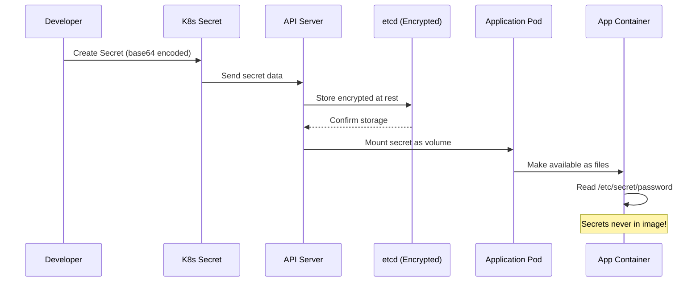

**Code:**
```bash
# Create Secret imperatively (from literals)
kubectl create secret generic db-secret \
  --from-literal=username=admin \
  --from-literal=password=$(openssl rand -base64 32)

# Create from files (more secure)
echo -n 'admin' > username.txt
echo -n 'supersecretpassword' > password.txt
kubectl create secret generic db-secret-file \
  --from-file=username.txt \
  --from-file=password.txt

# Create a TLS secret
openssl req -x509 -newkey rsa:4096 -keyout key.pem -out cert.pem -days 365 -nodes
kubectl create secret tls my-tls-secret --cert=cert.pem --key=key.pem

# View Secrets (values are base64 encoded)
kubectl get secrets
kubectl describe secret db-secret

# Decode a secret value
kubectl get secret db-secret -o jsonpath='{.data.password}' | base64 --decode

# Use Secret in a Pod
cat > pod-with-secret.yaml << 'EOF'
apiVersion: v1
kind: Pod
metadata:
  name: secret-pod
spec:
  containers:
  - name: app-container
    image: nginx
    env:
    - name: DB_USERNAME
      valueFrom:
        secretKeyRef:
          name: db-secret
          key: username
    volumeMounts:
    - name: secret-volume
      mountPath: /etc/secret
      readOnly: true
  volumes:
  - name: secret-volume
    secret:
      secretName: db-secret-file
EOF

kubectl apply -f pod-with-secret.yaml

# Check secret as environment variable
kubectl exec secret-pod -- echo $DB_USERNAME

# Check secret as file
kubectl exec secret-pod -- cat /etc/secret/password.txt

# Clean up
kubectl delete pod secret-pod
kubectl delete secret db-secret db-secret-file my-tls-secret
rm username.txt password.txt cert.pem key.pem
```

---

### **Scenario 9: Persistent Storage with Volumes**
*Storing data that survives pod restarts*

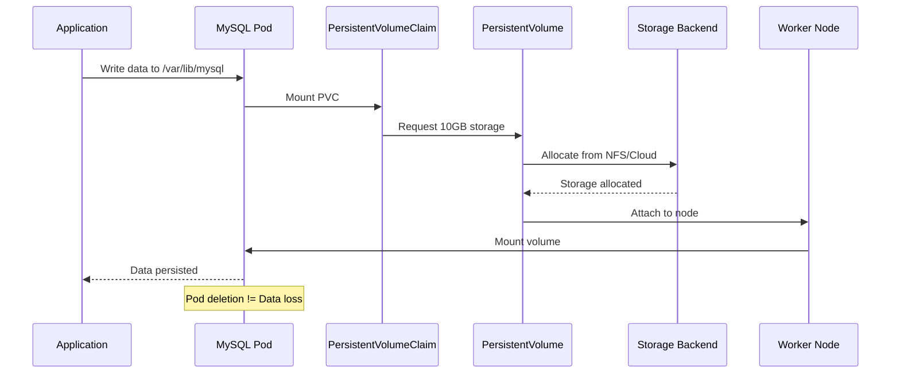

**Code:**
```bash
# Create a PersistentVolume (for Minikube)
cat > mysql-pv.yaml << 'EOF'
apiVersion: v1
kind: PersistentVolume
metadata:
  name: mysql-pv
spec:
  capacity:
    storage: 10Gi
  accessModes:
    - ReadWriteOnce
  storageClassName: manual
  hostPath:
    path: /data/mysql
EOF

# Create a PersistentVolumeClaim
cat > mysql-pvc.yaml << 'EOF'
apiVersion: v1
kind: PersistentVolumeClaim
metadata:
  name: mysql-pvc
spec:
  storageClassName: manual
  accessModes:
    - ReadWriteOnce
  resources:
    requests:
      storage: 10Gi
EOF

# Create MySQL Deployment with PVC
cat > mysql-deployment.yaml << 'EOF'
apiVersion: apps/v1
kind: Deployment
metadata:
  name: mysql
spec:
  replicas: 1
  selector:
    matchLabels:
      app: mysql
  template:
    metadata:
      labels:
        app: mysql
    spec:
      containers:
      - name: mysql
        image: mysql:8.0
        env:
        - name: MYSQL_ROOT_PASSWORD
          value: "secretpassword"
        ports:
        - containerPort: 3306
        volumeMounts:
        - name: mysql-storage
          mountPath: /var/lib/mysql
      volumes:
      - name: mysql-storage
        persistentVolumeClaim:
          claimName: mysql-pvc
EOF

kubectl apply -f mysql-pv.yaml
kubectl apply -f mysql-pvc.yaml
kubectl apply -f mysql-deployment.yaml

# Check PVC status
kubectl get pvc

# Check PV status
kubectl get pv

# Create some data in MySQL
kubectl exec -it deployment/mysql -- mysql -uroot -psecretpassword -e "CREATE DATABASE testdb;"

# Restart the pod
kubectl delete pod -l app=mysql

# Verify data persists
kubectl exec -it deployment/mysql -- mysql -uroot -psecretpassword -e "SHOW DATABASES;"

# Clean up
kubectl delete deployment mysql
kubectl delete pvc mysql-pvc
kubectl delete pv mysql-pv
```

---

### **Scenario 10: HTTP Routing with Ingress**
*Exposing services via HTTP/HTTPS routes*

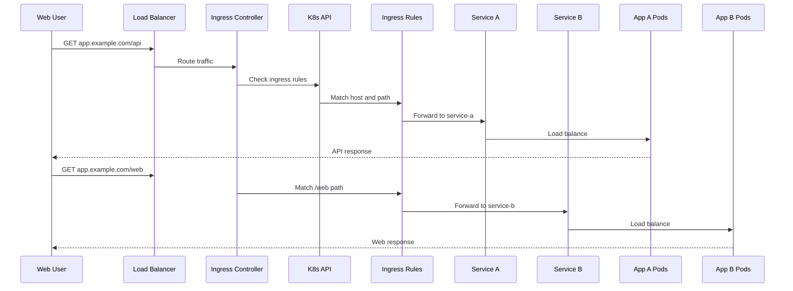

**Code:**
```bash
# Enable ingress addon in Minikube
minikube addons enable ingress

# Create two sample applications
kubectl create deployment app-a --image=nginx
kubectl create service clusterip app-a --tcp=80:80

kubectl create deployment app-b --image=httpd
kubectl create service clusterip app-b --tcp=80:80

# Create Ingress resource
cat > ingress-rules.yaml << 'EOF'
apiVersion: networking.k8s.io/v1
kind: Ingress
metadata:
  name: my-ingress
  annotations:
    nginx.ingress.kubernetes.io/rewrite-target: /
spec:
  rules:
  - host: app.example.com
    http:
      paths:
      - path: /api
        pathType: Prefix
        backend:
          service:
            name: app-a
            port:
              number: 80
      - path: /web
        pathType: Prefix
        backend:
          service:
            name: app-b
            port:
              number: 80
EOF

kubectl apply -f ingress-rules.yaml

# Get ingress info
kubectl get ingress

# Get ingress IP
kubectl get ingress my-ingress

# Add to /etc/hosts for testing
echo "$(minikube ip) app.example.com" | sudo tee -a /etc/hosts

# Test the routes
curl http://app.example.com/api
curl http://app.example.com/web

# Create TLS secret for HTTPS
kubectl create secret tls tls-secret --cert=cert.pem --key=key.pem

# Update ingress for TLS
cat > ingress-tls.yaml << 'EOF'
apiVersion: networking.k8s.io/v1
kind: Ingress
metadata:
  name: my-ingress-tls
spec:
  tls:
  - hosts:
    - app.example.com
    secretName: tls-secret
  rules:
  - host: app.example.com
    http:
      paths:
      - path: /
        pathType: Prefix
        backend:
          service:
            name: app-a
            port:
              number: 80
EOF

# Clean up
kubectl delete ingress my-ingress my-ingress-tls
kubectl delete service app-a app-b
kubectl delete deployment app-a app-b
```

---

### **Scenario 11: Namespaces for Isolation**
*Organizing resources in logical groups*

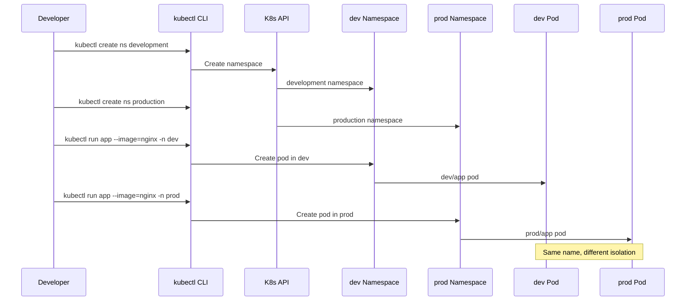

**Code:**
```bash
# List all namespaces
kubectl get namespaces

# See default namespaces
# kube-system, kube-public, kube-node-lease, default

# Create a new namespace
kubectl create namespace development
kubectl create namespace production

# Create resources in specific namespace
kubectl run nginx-dev --image=nginx -n development
kubectl run nginx-prod --image=nginx -n production

# Get resources from specific namespace
kubectl get pods -n development
kubectl get pods -n production

# Set namespace preference
kubectl config set-context --current --namespace=development

# Now all commands use 'development' namespace
kubectl get pods  # Shows dev pods only

# View resources across all namespaces
kubectl get pods --all-namespaces

# Create a resource quota
cat > quota.yaml << 'EOF'
apiVersion: v1
kind: ResourceQuota
metadata:
  name: dev-quota
  namespace: development
spec:
  hard:
    requests.cpu: "2"
    requests.memory: 2Gi
    limits.cpu: "4"
    limits.memory: 4Gi
    pods: "10"
    services: "5"
EOF

kubectl apply -f quota.yaml

# Check quota usage
kubectl describe quota dev-quota -n development

# Create network policy for namespace isolation
cat > network-policy.yaml << 'EOF'
apiVersion: networking.k8s.io/v1
kind: NetworkPolicy
metadata:
  name: dev-isolation
  namespace: development
spec:
  podSelector: {}
  policyTypes:
  - Ingress
  - Egress
  ingress:
  - from:
    - namespaceSelector:
        matchLabels:
          name: development
EOF

kubectl apply -f network-policy.yaml

# Clean up
kubectl delete namespace development production
```

---

## ADVANCED LEVEL: Production-Ready Patterns

### **Scenario 12: Health Checks - Liveness & Readiness Probes**
*Ensuring containers are healthy and ready to serve traffic*

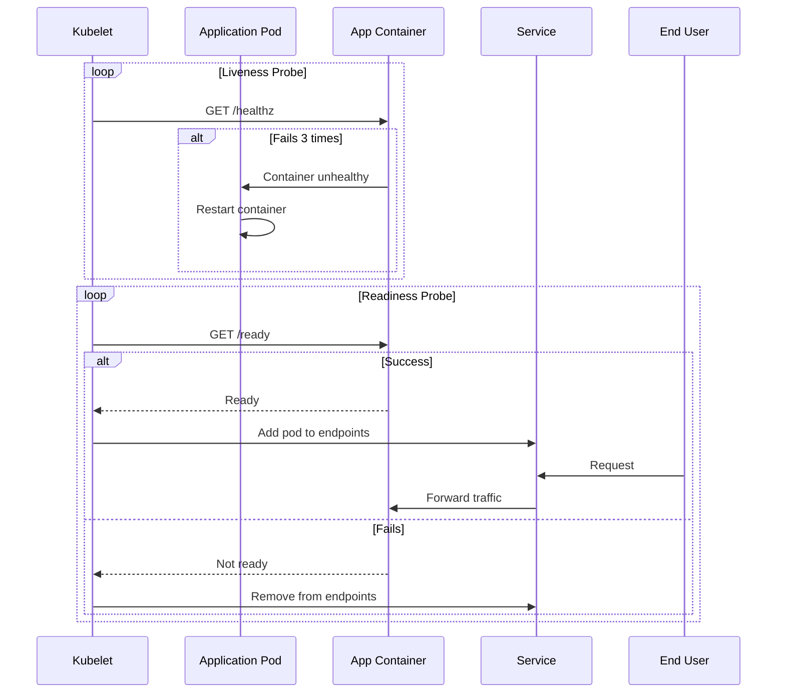

**Code:**
```bash
# Create a pod with liveness and readiness probes
cat > health-check-pod.yaml << 'EOF'
apiVersion: v1
kind: Pod
metadata:
  name: health-check-app
spec:
  containers:
  - name: app-container
    image: nginx
    ports:
    - containerPort: 80
    # Liveness probe - checks if container is alive
    livenessProbe:
      httpGet:
        path: /healthz
        port: 80
      initialDelaySeconds: 10
      periodSeconds: 5
      failureThreshold: 3
    # Readiness probe - checks if container is ready to serve traffic
    readinessProbe:
      httpGet:
        path: /ready
        port: 80
      initialDelaySeconds: 5
      periodSeconds: 3
      failureThreshold: 2
    # Startup probe - checks if application has started
    startupProbe:
      httpGet:
        path: /startup
        port: 80
      failureThreshold: 30
      periodSeconds: 10
EOF

# Create custom health check endpoints
cat > health-check-deployment.yaml << 'EOF'
apiVersion: apps/v1
kind: Deployment
metadata:
  name: health-check-app
spec:
  replicas: 3
  selector:
    matchLabels:
      app: health-app
  template:
    metadata:
      labels:
        app: health-app
    spec:
      containers:
      - name: app-container
        image: nginx:alpine
        ports:
        - containerPort: 80
        # Create health check endpoints
        lifecycle:
          postStart:
            exec:
              command:
              - /bin/sh
              - -c
              - |
                echo 'server{location=/healthz{return 200 "OK\n";}location=/ready{return 200 "READY\n";}location=/startup{return 200 "UP\n";}}' > /etc/nginx/conf.d/health.conf && nginx -s reload
        livenessProbe:
          httpGet:
            path: /healthz
            port: 80
          initialDelaySeconds: 15
          periodSeconds: 10
        readinessProbe:
          httpGet:
            path: /ready
            port: 80
          initialDelaySeconds: 5
          periodSeconds: 5
EOF

kubectl apply -f health-check-deployment.yaml

# Create service
kubectl expose deployment health-check-app --port=80 --name=health-svc

# Check probe status
kubectl describe pod -l app=health-app

# Simulate failure - delete health endpoint
kubectl exec deployment/health-check-app -- rm /etc/nginx/conf.d/health.conf
kubectl exec deployment/health-check-app -- nginx -s reload

# Watch pod restart
kubectl get pods -l app=health-app -w

# Clean up
kubectl delete deployment health-check-app
kubectl delete service health-svc
```

---

### **Scenario 13: Resource Limits and Requests**
*Managing cluster resources efficiently*

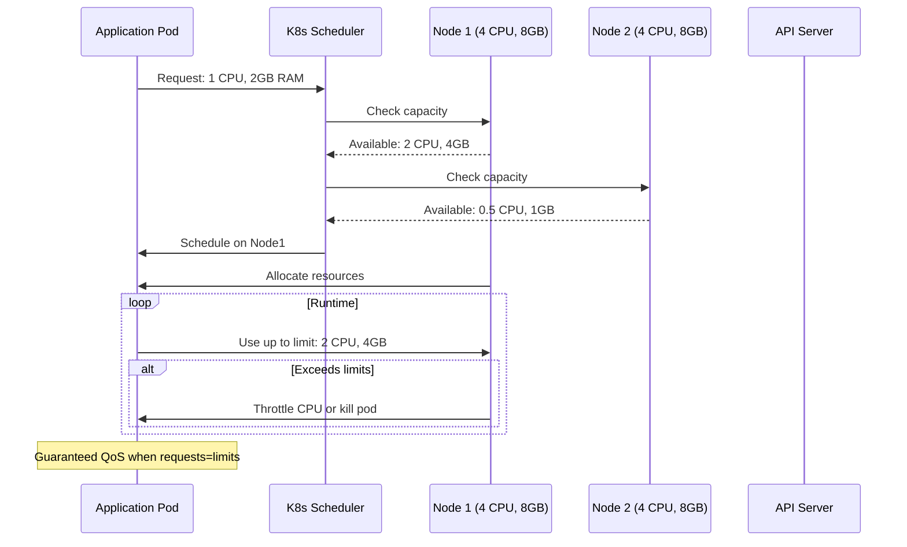

**Code:**
```bash
# Create a pod with resource requests and limits
cat > resource-pod.yaml << 'EOF'
apiVersion: v1
kind: Pod
metadata:
  name: resource-demo
spec:
  containers:
  - name: stress-container
    image: polinux/stress
    resources:
      requests:
        memory: "256Mi"
        cpu: "250m"
      limits:
        memory: "512Mi"
        cpu: "500m"
    command: ["stress"]
    args: ["--vm", "1", "--vm-bytes", "200M", "--vm-hang", "0"]
EOF

kubectl apply -f resource-pod.yaml

# Monitor resource usage
kubectl top pods

# Describe pod to see resource allocation
kubectl describe pod resource-demo

# Create a resource-constrained namespace
cat > resource-quota.yaml << 'EOF'
apiVersion: v1
kind: ResourceQuota
metadata:
  name: compute-quota
  namespace: production
spec:
  hard:
    requests.memory: 4Gi
    requests.cpu: 2
    limits.memory: 8Gi
    limits.cpu: 4
    pods: "10"
EOF

kubectl apply -f resource-quota.yaml

# Create LimitRange for default resource settings
cat > limit-range.yaml << 'EOF'
apiVersion: v1
kind: LimitRange
metadata:
  name: default-resources
  namespace: production
spec:
  limits:
  - default:
      memory: 512Mi
      cpu: 500m
    defaultRequest:
      memory: 256Mi
      cpu: 250m
    type: Container
EOF

kubectl apply -f limit-range.yaml

# Deploy with guaranteed QoS
cat > guaranteed-pod.yaml << 'EOF'
apiVersion: v1
kind: Pod
metadata:
  name: guaranteed-qos
spec:
  containers:
  - name: app-container
    image: nginx
    resources:
      requests:
        memory: "512Mi"
        cpu: "500m"
      limits:
        memory: "512Mi"
        cpu: "500m"
EOF

kubectl apply -f guaranteed-pod.yaml

# Check QoS class
kubectl get pod guaranteed-qos -o jsonpath='{.status.qosClass}'

# Clean up
kubectl delete pod resource-demo guaranteed-qos
kubectl delete resourcequota compute-quota -n production
kubectl delete limitrange default-resources -n production
```

---

### **Scenario 14: Jobs and CronJobs**
*Running batch and scheduled tasks*

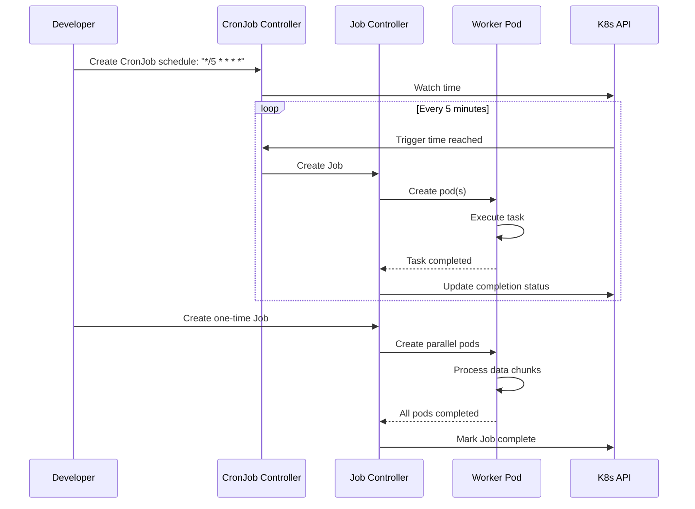

**Code:**
```bash
# Create a one-time Job
cat > job.yaml << 'EOF'
apiVersion: batch/v1
kind: Job
metadata:
  name: data-processor
spec:
  completions: 5  # Run 5 pods successfully
  parallelism: 2  # Run 2 pods in parallel
  template:
    spec:
      containers:
      - name: processor
        image: busybox
        command: ["sh", "-c", "echo Processing item $JOB_COMPLETION_INDEX && sleep 5"]
        env:
        - name: JOB_COMPLETION_INDEX
          valueFrom:
            fieldRef:
              fieldPath: metadata.annotations['batch.kubernetes.io/job-completion-index']
      restartPolicy: OnFailure
EOF

kubectl apply -f job.yaml

# Watch Job progress
kubectl get jobs -w
kubectl get pods -w

# View Job logs
kubectl logs data-processor-XX

# Create a CronJob
cat > cronjob.yaml << 'EOF'
apiVersion: batch/v1
kind: CronJob
metadata:
  name: backup-job
spec:
  schedule: "*/5 * * * *"  # Every 5 minutes
  jobTemplate:
    spec:
      template:
        spec:
          containers:
          - name: backup
            image: busybox
            command:
            - /bin/sh
            - -c
            - echo "Running backup at $(date)" && sleep 10
          restartPolicy: OnFailure
  successfulJobsHistoryLimit: 3
  failedJobsHistoryLimit: 1
EOF

kubectl apply -f cronjob.yaml

# View CronJob
kubectl get cronjob

# View CronJob schedule
kubectl get cronjob backup-job -o jsonpath='{.spec.schedule}'

# View completed Jobs
kubectl get jobs

# Suspend a CronJob
kubectl patch cronjob backup-job -p '{"spec":{"suspend":true}}'

# Resume it
kubectl patch cronjob backup-job -p '{"spec":{"suspend":false}}'

# Clean up
kubectl delete job data-processor
kubectl delete cronjob backup-job
```

---

### **Scenario 15: StatefulSets for Stateful Applications**
*Running databases and stateful workloads*

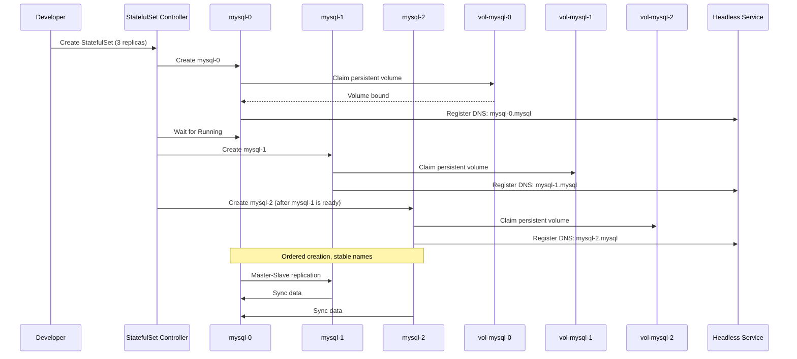

**Code:**
```bash
# Create Headless Service for StatefulSet
cat > mysql-service.yaml << 'EOF'
apiVersion: v1
kind: Service
metadata:
  name: mysql
  labels:
    app: mysql
spec:
  ports:
  - port: 3306
    name: mysql
  clusterIP: None  # Headless service
  selector:
    app: mysql
EOF

# Create StatefulSet
cat > mysql-statefulset.yaml << 'EOF'
apiVersion: apps/v1
kind: StatefulSet
metadata:
  name: mysql
spec:
  serviceName: mysql
  replicas: 3
  selector:
    matchLabels:
      app: mysql
  template:
    metadata:
      labels:
        app: mysql
    spec:
      containers:
      - name: mysql
        image: mysql:8.0
        env:
        - name: MYSQL_ROOT_PASSWORD
          value: "secretpassword"
        ports:
        - containerPort: 3306
          name: mysql
        volumeMounts:
        - name: mysql-data
          mountPath: /var/lib/mysql
  volumeClaimTemplates:
  - metadata:
      name: mysql-data
    spec:
      accessModes: ["ReadWriteOnce"]
      resources:
        requests:
          storage: 10Gi
EOF

kubectl apply -f mysql-service.yaml
kubectl apply -f mysql-statefulset.yaml

# View StatefulSet
kubectl get statefulset

# View pods with stable names
kubectl get pods -l app=mysql

# View persistent volume claims
kubectl get pvc -l app=mysql

# Scale StatefulSet
kubectl scale statefulset mysql --replicas=5

# Check ordered scaling
kubectl get pods -w -l app=mysql

# Check stable DNS entries
kubectl run -i --tty --image busybox dns-test --rm --restart=Never -- nslookup mysql-0.mysql

# Rolling update
kubectl patch statefulset mysql --type='json' -p='[{"op": "replace", "path": "/spec/template/spec/containers/0/image", "value":"mysql:8.0.33"}]'

# Clean up
kubectl delete statefulset mysql
kubectl delete service mysql
kubectl delete pvc -l app=mysql
```

---

### **Scenario 16: RBAC for Security**
*Role-Based Access Control for cluster security*

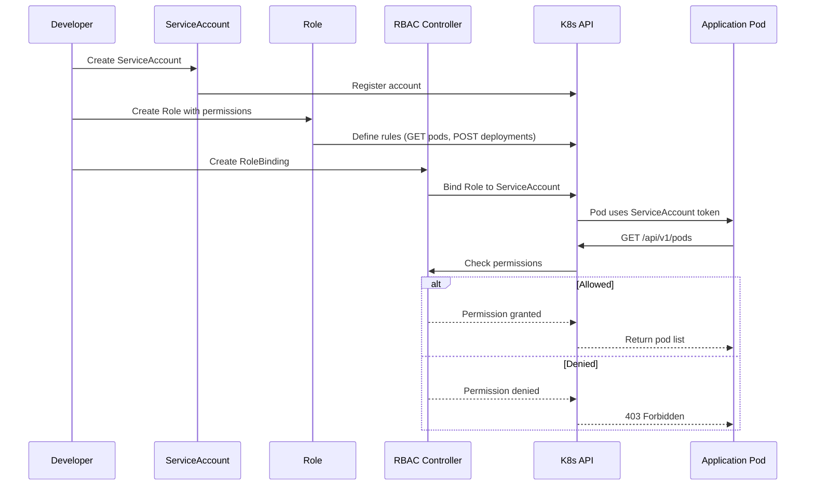

**Code:**
```bash
# Create a ServiceAccount
kubectl create serviceaccount dev-user -n default

# Create a Role with limited permissions
cat > dev-role.yaml << 'EOF'
apiVersion: rbac.authorization.k8s.io/v1
kind: Role
metadata:
  namespace: development
  name: developer-role
rules:
- apiGroups: [""]
  resources: ["pods", "pods/log"]
  verbs: ["get", "list", "watch"]
- apiGroups: [""]
  resources: ["pods/portforward"]
  verbs: ["create"]
- apiGroups: ["apps"]
  resources: ["deployments"]
  verbs: ["get", "list", "watch", "create", "update", "patch"]
- apiGroups: [""]
  resources: ["configmaps", "secrets"]
  verbs: ["get", "list", "watch"]
EOF

kubectl apply -f dev-role.yaml

# Create RoleBinding
cat > dev-rolebinding.yaml << 'EOF'
apiVersion: rbac.authorization.k8s.io/v1
kind: RoleBinding
metadata:
  name: developer-binding
  namespace: development
subjects:
- kind: ServiceAccount
  name: dev-user
  namespace: default
- kind: User
  name: jane@example.com
  apiGroup: rbac.authorization.k8s.io
roleRef:
  kind: Role
  name: developer-role
  apiGroup: rbac.authorization.k8s.io
EOF

kubectl apply -f dev-rolebinding.yaml

# Create ClusterRole for cluster-wide access
cat > cluster-reader-role.yaml << 'EOF'
apiVersion: rbac.authorization.k8s.io/v1
kind: ClusterRole
metadata:
  name: cluster-reader
rules:
- apiGroups: [""]
  resources: ["nodes", "namespaces"]
  verbs: ["get", "list", "watch"]
- apiGroups: ["metrics.k8s.io"]
  resources: ["nodes", "pods"]
  verbs: ["get", "list"]
EOF

# Create ClusterRoleBinding
kubectl create clusterrolebinding cluster-reader-binding \
  --clusterrole=cluster-reader \
  --serviceaccount=default:dev-user

# Test permissions
# Get token for ServiceAccount
SECRET=$(kubectl get serviceaccount dev-user -o jsonpath='{.secrets[0].name}')
TOKEN=$(kubectl get secret $SECRET -o jsonpath='{.data.token}' | base64 --decode)

# Use token to test access
kubectl auth can-i get pods --as=system:serviceaccount:default:dev-user -n development

# View ClusterRoles
kubectl get clusterroles

# View RoleBindings
kubectl get rolebindings --all-namespaces

# Clean up
kubectl delete rolebinding developer-binding -n development
kubectl delete role developer-role -n development
kubectl delete clusterrolebinding cluster-reader-binding
kubectl delete clusterrole cluster-reader
kubectl delete serviceaccount dev-user
```

---

### **Scenario 17: Helm for Package Management**
*Managing complex Kubernetes applications*

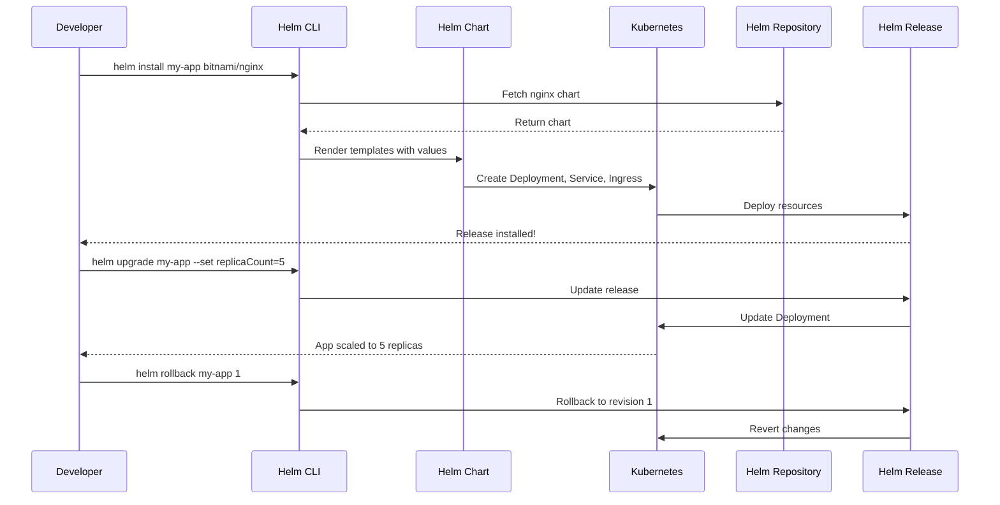

**Code:**
```bash
# Install Helm
# macOS: brew install helm
# Linux: curl https://raw.githubusercontent.com/helm/helm/main/scripts/get-helm-3 | bash

# Add a Helm repository
helm repo add bitnami https://charts.bitnami.com/bitnami
helm repo update

# Search for charts
helm search repo nginx

# Install an application
helm install my-nginx bitnami/nginx

# View installed releases
helm list

# Get release status
helm status my-nginx

# View release history
helm history my-nginx

# Upgrade the release
helm upgrade my-nginx bitnami/nginx --set replicaCount=3 --set service.type=NodePort

# Rollback to previous version
helm rollback my-nginx 1

# Uninstall release
helm uninstall my-nginx

# Create your own chart
helm create my-app

# Chart structure:
# my-app/
#   Chart.yaml          # Chart metadata
#   values.yaml         # Default values
#   templates/          # Manifest templates
#     deployment.yaml
#     service.yaml
#     ingress.yaml
#   charts/            # Dependencies

# Install your custom chart
helm install my-release ./my-app

# Package chart
helm package ./my-app

# Lint chart for errors
helm lint ./my-app

# Dry run - see what will be deployed
helm install --dry-run --debug my-release ./my-app

# Create chart with dependencies
cat > my-app/Chart.yaml << 'EOF'
apiVersion: v2
name: my-app
version: 0.1.0
dependencies:
- name: postgresql
  version: 12.1.2
  repository: https://charts.bitnami.com/bitnami
EOF

helm dependency update ./my-app

# Template variables in templates/deployment.yaml
cat > my-app/templates/deployment.yaml << 'EOF'
apiVersion: apps/v1
kind: Deployment
metadata:
  name: {{ .Release.Name }}-deployment
spec:
  replicas: {{ .Values.replicaCount }}
  template:
    spec:
      containers:
      - name: {{ .Chart.Name }}
        image: "{{ .Values.image.repository }}:{{ .Values.image.tag }}"
        ports:
        - containerPort: {{ .Values.service.port }}
EOF

# Clean up
helm repo remove bitnami
```

---

### **Scenario 18: Debugging & Troubleshooting**
*Advanced techniques for diagnosing issues*

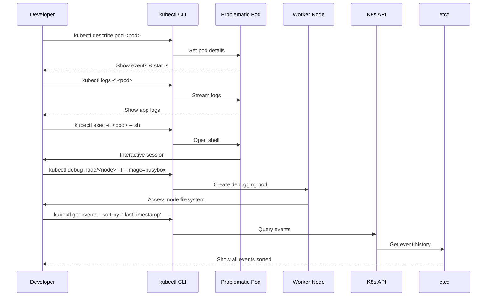

**Code:**
```bash
# Get detailed information about a pod
kubectl describe pod <pod-name>

# View all events in the cluster
kubectl get events

# View events sorted by time
kubectl get events --sort-by='.lastTimestamp'

# Stream logs in real-time
kubectl logs -f <pod-name>

# View logs from previous container instance
kubectl logs <pod-name> --previous

# View logs from specific container in multi-container pod
kubectl logs <pod-name> -c <container-name>

# Execute commands in a running pod
kubectl exec -it <pod-name> -- /bin/bash

# Copy files from pod to local
kubectl cp <pod-name>:/path/to/file ./local-file

# Debug a crashing container with ephemeral debug container
kubectl debug -it <pod-name> --image=busybox --target=<container-name>

# Debug a node (requires privileged access)
kubectl debug node/<node-name> -it --image=busybox

# Get resource utilization
kubectl top pods
kubectl top nodes

# Check API server health
kubectl get --raw='/readyz?verbose'

# Check etcd health
kubectl -n kube-system exec etcd-minikube -- etcdctl endpoint health

# View kubelet logs on a node
kubectl -n kube-system logs kubelet-<node-name>

# Use stern for multi-pod log aggregation
# Install: brew install stern
stern app --tail 20

# Port forward to access service locally
kubectl port-forward svc/<service-name> 8080:80

# Check DNS resolution
kubectl run -i --tty --rm dns-test --image=busybox --restart=Never -- nslookup kubernetes.default

# Check network policies
kubectl describe networkpolicy

# Generate pod security policy report
kubectl get psp

# Check for deprecated APIs
kubectl get deployments -o json | jq '.items[] | select(.apiVersion | contains("extensions/v1beta1"))'

# Validate manifests without applying
kubectl apply --dry-run=client -f manifest.yaml

# Use kube-score for static analysis
kube-score score manifest.yaml
```

---

## Quick Reference: Essential Commands

| Command | Description | Level |
| :--- | :--- | :--- |
| `kubectl get pods` | List all pods | Beginner |
| `kubectl apply -f <file>` | Create/update resources | Beginner |
| `kubectl logs <pod>` | View pod logs | Beginner |
| `kubectl exec -it <pod> -- bash` | Shell into pod | Beginner |
| `kubectl delete <resource> <name>` | Delete a resource | Beginner |
| `kubectl create deployment <name>` | Create deployment | Beginner |
| `kubectl expose deployment <name>` | Create service | Intermediate |
| `kubectl scale deployment <name>` | Scale replicas | Intermediate |
| `kubectl rollout status <deploy>` | Check rollout status | Intermediate |
| `kubectl create configmap <name>` | Create ConfigMap | Intermediate |
| `kubectl create secret <name>` | Create Secret | Intermediate |
| `kubectl get nodes` | List cluster nodes | Intermediate |
| `kubectl describe <resource> <name>` | Show detailed info | Intermediate |
| `kubectl rollout undo <deploy>` | Rollback deployment | Advanced |
| `kubectl create role <name>` | Create RBAC role | Advanced |
| `kubectl taint nodes <node>` | Taint nodes | Advanced |
| `kubectl debug <pod>` | Debug pod | Advanced |
| `helm install <release> <chart>` | Install Helm chart | Advanced |

---

## Pro Tips for All Levels

1. **Always use YAML manifests**: Avoid imperative commands for production
2. **Use namespaces**: Separate dev, staging, and production environments
3. **Label everything**: Use labels for organization and selection
4. **Set resource limits**: Prevent noisy neighbor issues and ensure stability
5. **Use ConfigMaps and Secrets**: Never hardcode configuration in images
6. **Health checks are critical**: Always implement liveness and readiness probes
7. **Monitor everything**: Use Prometheus and Grafana for observability
8. **Backup etcd**: Critical for cluster recovery
9. **Keep Kubernetes updated**: Stay on supported versions
10. **Use GitOps**: Tools like ArgoCD or Flux for declarative deployments
11. **Network policies**: Secure pod-to-pod communication
12. **Pod security standards**: Follow restricted security policies

Happy orchestrating! ☸️